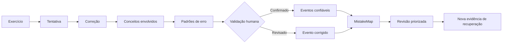
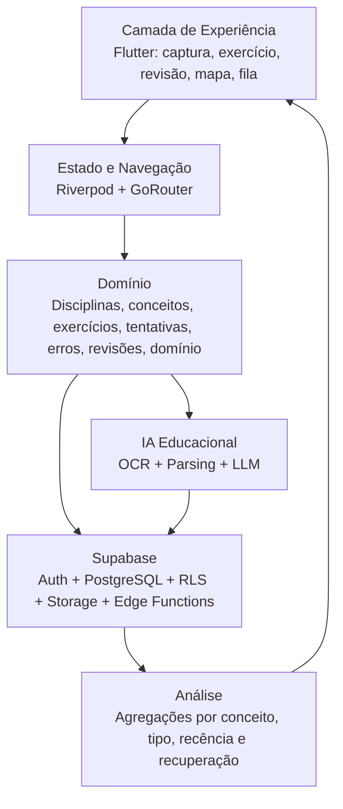
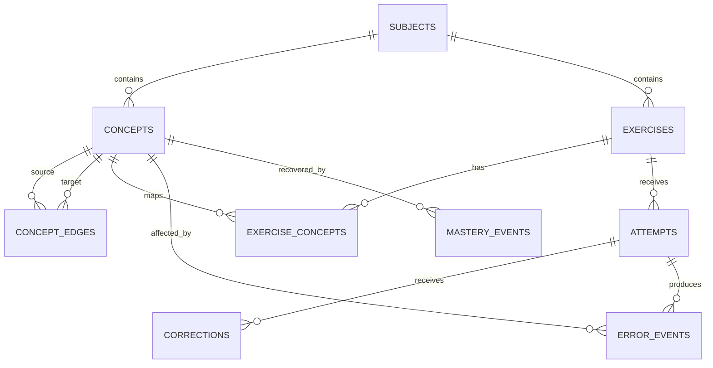
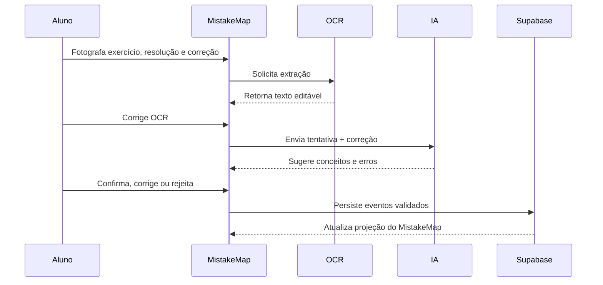
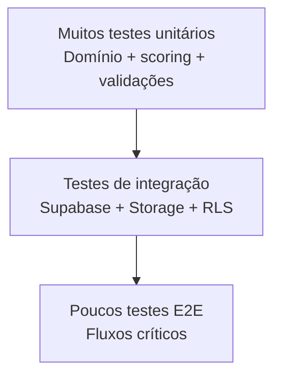

<a id="readme-top"></a>

<div align="center">

# MistakeMap

### Mapa dos Padrões de Erro do Estudante

Plataforma de aprendizagem orientada a erros que transforma exercícios corrigidos em uma estrutura navegável de **conceitos, padrões recorrentes, evidências de recuperação e evolução**.

<br>

[](https://github.com/CFSJCODE/MISTAKEMAP)


<br>

**MistakeMap não é apenas um corretor de certo ou errado.**  
Ele procura responder a uma pergunta mais útil:

> **“Que padrão existe por trás dos meus erros e em quais conceitos esse padrão aparece repetidamente?”**

</div>

<br>

---

<br>

<a id="sobre-o-projeto"></a>

## Sobre o projeto

O **MistakeMap** é um aplicativo que transforma exercícios corrigidos em um **grafo de fragilidades conceituais, tipos de erro, recorrência e evolução**, orientando o processo de revisão sem reduzir o estudante a uma nota.

O estudante pode fotografar exercícios corrigidos ou registrar sua resolução manualmente. A aplicação identifica conceitos envolvidos, sugere padrões de erro — como **negação lógica, unidade, sinal, condição de contorno ou interpretação** — e constrói um mapa temporal após validação do estudante.

A essência do projeto é simples:

<br>

### Fluxo conceitual do MistakeMap



> [!IMPORTANT]
> O **MistakeMap trata o erro como dado de aprendizagem**: um evento contextual que pode ser observado, validado, relacionado a conceitos e acompanhado ao longo do tempo.

<br>

---

<br>

<a id="identificacao-academica"></a>

## Identificação acadêmica

| Campo | Informação |
|:---|:---|
| **Instituição** | Pontifícia Universidade Católica de Minas Gerais — **PUC Minas** |
| **Curso** | Engenharia de Computação |
| **Disciplina** | Projeto Integrado I: Desenvolvimento Móvel |
| **Discentes** | **Cláudio Francisco Dos Santos Júnior** · **Lucas Emanuel Simão Silva** |
| **Orientação** | **Ilo Amy Saldanha Rivero** |
| **Versão do documento** | 1.0 — Agosto de 2026 |

> [!NOTE]
> O projeto é desenvolvido no contexto acadêmico da disciplina **Projeto Integrado I: Desenvolvimento Móvel**, articulando engenharia de software, experiência do usuário, modelagem de dados e inteligência artificial aplicada à aprendizagem.

<br>

---

<br>

<a id="stack-tecnologica"></a>

## Tecnologias

<br>

### Aplicação e arquitetura Flutter

<p>
  
  
  
  
</p>

<br>

### Backend e dados

<p>
  
  
  
  
</p>

<br>

### Inteligência e processamento

<p>
  
  
  
  
</p>

<br>

### Plataformas

<p>
  
  
  
</p>

<br>

### Stack principal

<div align="center">
<table>
  <tr>
    <td align="center" width="145">
      <br>
      <strong>Flutter</strong><br><sub>Interface</sub>
    </td>
    <td align="center" width="145">
      <br>
      <strong>Dart</strong><br><sub>Linguagem</sub>
    </td>
    <td align="center" width="145">
      <br>
      <strong>Supabase</strong><br><sub>Backend</sub>
    </td>
    <td align="center" width="145">
      <br>
      <strong>PostgreSQL</strong><br><sub>Persistência</sub>
    </td>
  </tr>
</table>
</div>

| Camada | Tecnologia | Responsabilidade |
|:---|:---|:---|
| **Frontend** | Flutter + Dart | Captura, edição, revisão e visualização |
| **Estado** | Riverpod | Gerenciamento de estado e injeção de dependências |
| **Navegação** | GoRouter | Rotas e deep links |
| **Backend** | Supabase | Auth, banco, Storage e jobs |
| **Banco** | PostgreSQL | Eventos e grafo conceitual via tabelas |
| **OCR** | Motor compatível | Texto/matemática com revisão manual |
| **IA** | LLM em backend | Sugestão de conceitos e erros |
| **Visualização** | `CustomPaint` / graph library | Mapa conceitual e evolução |

<br>

---

<br>

<a id="metadados"></a>

## Informações do projeto

| Campo | Definição |
|:---|:---|
| **Projeto** | MistakeMap |
| **Documento-base** | Concepção, Arquitetura e Roadmap de Implementação |
| **Contexto de aplicação** | Estudo individual, matemática, física, computação, engenharias e disciplinas baseadas em resolução de problemas |
| **Stack principal** | Flutter + Dart + Supabase/PostgreSQL + Storage + OCR/LLM + grafo conceitual |
| **Plataformas** | Android, Windows e Web |
| **Versão** | **1.0 — Agosto de 2026** |
| **Status** | Concepção / MVP |
| **Repositório** | [`CFSJCODE/MISTAKEMAP`](https://github.com/CFSJCODE/MISTAKEMAP) |

<br>

---

<br>

<a id="sumario"></a>

## Navegação

<details>
<summary><strong>Abrir sumário completo</strong></summary>

<br>

- [Sobre o projeto](#sobre-o-projeto)
- [Identificação acadêmica](#identificacao-academica)
- [Tecnologias](#stack-tecnologica)
- [Informações do projeto](#metadados)
- [Visão Executiva](#visao-executiva)
- [Objetivos](#objetivos)
- [Problema e Cenário de Uso](#problema-e-cenario-de-uso)
- [Escopo Funcional](#escopo-funcional)
- [Regras de Domínio](#regras-de-dominio)
- [Pipeline de Extração e IA](#pipeline-de-extracao-e-ia)
- [Modelagem de Prioridade](#modelagem-de-prioridade)
- [Limites e Salvaguardas](#limites-e-salvaguardas)
- [Arquitetura de Software](#arquitetura-de-software)
- [Modelo de Dados](#modelo-de-dados)
- [Relacionamentos](#relacionamentos)
- [Regras de Integridade](#regras-de-integridade)
- [Segurança e Privacidade](#seguranca-e-privacidade)
- [Experiência do Usuário](#experiencia-do-usuario)
- [Fluxos Operacionais](#fluxos-operacionais)
- [Relatórios e Exportações](#relatorios-e-exportacoes)
- [Arquitetura Flutter](#arquitetura-flutter)
- [Offline e Sincronização](#offline-e-sincronizacao)
- [Roadmap](#roadmap)
- [MVP Recomendado](#mvp-recomendado)
- [Critérios de Aceitação](#criterios-de-aceitacao)
- [Testes e Qualidade](#testes-e-qualidade)
- [Evoluções Futuras](#evolucoes-futuras)
- [Recomendação de Implementação](#recomendacao-de-implementacao)
- [Exemplo de Registro](#exemplo-de-registro)
- [Indicadores de Produto](#indicadores-de-produto)
- [Execução](#execucao)
- [Síntese](#sintese)

</details>

<br>

---

<br>

<a id="visao-executiva"></a>

## Visão Executiva

A proposta é desenvolver um **aplicativo de aprendizagem orientado a erros**.

O estudante registra:

- exercício;
- enunciado;
- solução;
- correção ou gabarito;
- disciplina.

**OCR e IA** extraem a estrutura do material e sugerem conceitos e padrões de falha.

<br>

### Exemplos de hipóteses

- “erra quando a expressão contém negação”;
- “perde unidade na conversão”;
- “aplica fórmula correta com condição inicial errada”;
- “confunde implicação com equivalência”;
- “omite caso de borda”.

O estudante revisa essas classificações. Em seguida, o sistema agrega as ocorrências em um mapa de conceitos e tipos de erro com:

1. **frequência**;
2. **recência**;
3. **importância**;
4. **evidências de recuperação**.

<br>

### Princípio de projeto

> [!NOTE]
> O erro é um **evento contextual**, não um rótulo permanente sobre o aluno.

O sistema deve preservar:

- o exercício;
- a tentativa;
- a evidência;
- o histórico.

Classificações automáticas devem ser tratadas como **sugestões**.

Uma fragilidade pode diminuir quando novos exercícios demonstram domínio.

<br>

---

<br>

<a id="objetivos"></a>

## Objetivos

- [ ] Registrar exercícios corrigidos e a solução produzida pelo estudante.
- [ ] Classificar erros por conceito, operação cognitiva e padrão recorrente.
- [ ] Construir mapa de fragilidades com evidências navegáveis.
- [ ] Priorizar revisão com base em frequência, recência, importância e recuperação.
- [ ] Distinguir erro conceitual, algébrico, aritmético, de unidade, leitura e atenção quando possível.
- [ ] Acompanhar evolução sem transformar o mapa em diagnóstico psicológico ou nota definitiva.

<br>

---

<br>

<a id="problema-e-cenario-de-uso"></a>

## Problema e Cenário de Uso

Ao estudar, o aluno frequentemente corrige uma questão e segue em frente. O histórico de **por que errou** desaparece.

Depois de dezenas de exercícios, padrões relevantes ficam invisíveis:

- sinais trocados;
- hipóteses esquecidas;
- negações mal distribuídas;
- unidades inconsistentes;
- condições de contorno omitidas.

Plataformas tradicionais acumulam acertos e notas, mas nem sempre organizam a **anatomia do erro**.

O MistakeMap cria uma memória de falhas e recuperações ligada ao conteúdo específico.

| Erro observado | Classificação candidata | Conceitos relacionados |
|:---|:---|:---|
| Negou “p e q” como “não p e não q” | Transformação lógica incorreta | Leis de De Morgan, negação, conjunção |
| Usou `3,6` sem converter km/h para m/s | Erro de unidade/conversão | Dimensões, velocidade, SI |
| Esqueceu `x(0)` em solução diferencial | Condição inicial omitida | EDO, solução geral, condição de contorno |
| Aplicou fórmula correta ao caso errado | Erro de seleção/modelagem | Hipóteses, domínio de validade |

> [!WARNING]
> A classificação deve ser **revisável**. Uma mesma resposta errada pode ter múltiplas causas possíveis e, sem explicação do estudante, o sistema deve registrar incerteza em vez de afirmar intenção cognitiva.

<br>

---

<br>

<a id="escopo-funcional"></a>

## Escopo Funcional

| Módulo | Funções principais |
|:---|:---|
| **Disciplinas** | Matérias, unidades, listas e fontes |
| **Conceitos** | Taxonomia/grafo de conceitos e pré-requisitos |
| **Exercícios** | Enunciado, imagem, fonte, dificuldade opcional e conceitos |
| **Tentativas** | Solução do estudante, resposta final, timestamp e tempo opcional |
| **Correções** | Gabarito, comentário do professor e marcações |
| **Erros** | Tipo, conceito, passo afetado, gravidade operacional e validação |
| **Mapa** | Fragilidades por conceito/tipo, evidências e evolução |
| **Revisão** | Fila de exercícios/conceitos prioritários e registro de recuperação |

<br>

<a id="regras-de-dominio"></a>

### Regras de Domínio

- Erro sugerido por IA permanece `pending` até validação ou confirmação contextual.
- Um exercício pode envolver vários conceitos e um erro pode afetar mais de um conceito.
- Erro corrigido em tentativas futuras não é apagado; sua prioridade diminui pela evidência de recuperação.
- A ausência de erro em poucos exercícios não prova domínio absoluto.
- O sistema não deve inferir transtorno, deficiência ou diagnóstico de aprendizagem.
- Conteúdo de provas/professores pode ter restrições de direitos; compartilhamento público não faz parte do MVP.

<br>

---

<br>

<a id="pipeline-de-extracao-e-ia"></a>

## Pipeline de Extração e IA

O pipeline precisa preservar a resolução do estudante, pois classificar apenas a resposta final perde informação.

OCR/visão extrai texto e expressões quando possível; um LLM compara tentativa, correção e conceitos da disciplina para propor eventos de erro. Um grafo conceitual conecta tópicos e pré-requisitos.

A prioridade de revisão é calculada sobre **eventos validados**, não sobre inferências ocultas.

<br>

### Etapas

| Etapa | Processamento | Resultado |
|:---|:---|:---|
| **1. Captura** | Imagem/PDF do exercício e solução; OCR ou digitação | Tentativa digitalizada |
| **2. Estrutura** | Separação entre enunciado, passos, resposta e correção | Representação do exercício |
| **3. Conceitos** | Busca/LLM sugere conceitos presentes | Nós candidatos do grafo |
| **4. Erros** | Comparação com correção sugere tipo, passo e explicação | Eventos `pending` |
| **5. Validação** | Aluno/professor confirma, corrige ou rejeita | Eventos confiáveis |
| **6. Agregação** | Frequência, recência e evidência de recuperação atualizam o mapa | Prioridade de revisão |

<br>

<a id="modelagem-de-prioridade"></a>

### Modelagem de Prioridade

Uma prioridade simples pode ser modelada por:

$$
P = F \cdot R \cdot I \cdot (1-M)
$$

Onde:

| Variável | Interpretação |
|:---:|:---|
| $F$ | Frequência normalizada do erro |
| $R$ | Fator de recência |
| $I$ | Importância do conceito |
| $M$ | Evidência de domínio/recuperação no intervalo $[0,1]$ |

> [!IMPORTANT]
> O objetivo de $P$ é **ordenar revisão**, não produzir uma nota sobre capacidade intelectual.

<br>

<a id="limites-e-salvaguardas"></a>

### Limites e Salvaguardas

- Reconhecimento de matemática manuscrita é imperfeito; oferecer edição do OCR e entrada manual.
- Comparar soluções exige tolerar métodos alternativos corretos.
- Um erro aparente pode ser apenas erro de transcrição do OCR.
- A causa cognitiva real nem sempre é observável; utilizar linguagem como **“padrão sugerido”**.
- Priorização deve ser transparente e ajustável para evitar comportamento excessivamente prescritivo.

<br>

---

<br>

<a id="arquitetura-de-software"></a>

## Arquitetura de Software

Flutter oferece captura, revisão e visualização do mapa. Supabase armazena exercícios, imagens, taxonomia, eventos e histórico. OCR/LLM permanecem em backend seguro; o grafo pode ser modelado relacionalmente por `concept_edges` no PostgreSQL, sem exigir banco de grafos no MVP.

<br>

### Visão em camadas



<br>

### Stack recomendada

| Camada | Tecnologia | Responsabilidade |
|:---|:---|:---|
| **Frontend** | Dart + Flutter | Câmera, editor, mapa e revisão |
| **Backend** | Supabase | Auth, banco, Storage e jobs |
| **Banco** | PostgreSQL | Eventos e grafo conceitual via tabelas |
| **OCR** | Motor compatível | Texto/matemática com revisão manual |
| **IA** | LLM backend | Sugestão de conceitos e erros |
| **Visualização** | `CustomPaint` / graph lib | Mapa conceitual e evolução |

<br>

---

<br>

<a id="modelo-de-dados"></a>

## Modelo de Dados no Supabase

A modelagem deve ser **event-oriented**: cada erro é uma ocorrência ligada a uma tentativa, enquanto o mapa é uma projeção agregada.

Isso permite recalcular prioridades sem modificar o histórico.

<br>

| Tabela | Campos essenciais | Observações |
|:---|:---|:---|
| `subjects` | `id`, `user_id`, `name`, `description` | Disciplina |
| `concepts` | `id`, `subject_id`, `name`, `description`, `importance` | Nó conceitual |
| `concept_edges` | `from_concept_id`, `to_concept_id`, `relation` | Pré-requisito/relacionamento |
| `exercises` | `id`, `subject_id`, `source`, `prompt_text`, `difficulty`, `created_at` | Questão |
| `exercise_concepts` | `exercise_id`, `concept_id`, `weight` | Relação N:N |
| `attempts` | `id`, `exercise_id`, `user_id`, `solution_text`, `answer`, `attempted_at` | Tentativa |
| `corrections` | `id`, `attempt_id`, `reference_text`, `attachment_id`, `reviewed_by` | Gabarito/comentário |
| `error_types` | `id`, `name`, `category`, `description` | Taxonomia de erro |
| `error_events` | `id`, `attempt_id`, `error_type_id`, `concept_id`, `evidence_ref`, `confidence`, `status` | Erro observado/sugerido |
| `mastery_events` | `id`, `concept_id`, `attempt_id`, `outcome`, `created_at` | Evidência de recuperação |

<br>

<a id="relacionamentos"></a>

### Relacionamentos



<br>

<a id="regras-de-integridade"></a>

### Regras de Integridade

- `error_events.status` deve ser `pending`, `confirmed`, `rejected` ou `superseded`.
- Um evento confirmado deve apontar para tentativa e evidência/passo suficientemente identificável.
- `concept_edges` não devem criar ciclos quando `relation=prerequisite`, salvo se permitido explicitamente.
- Excluir disciplina exige arquivamento/cascade controlado para não quebrar tentativas.
- Resultados de prioridade são derivados e recalculáveis; eventos históricos permanecem imutáveis.

<br>

---

<br>

<a id="seguranca-e-privacidade"></a>

## Segurança, Privacidade e Controle de Acesso

Cadernos, provas, notas e padrões de desempenho são **dados pessoais educacionais**.

Mesmo em uso individual, o produto deve impedir exposição entre contas e evitar telemetria que associe conteúdo de exercícios à identidade sem necessidade.

<br>

### Controles recomendados

| Mecanismo | Aplicação |
|:---|:---|
| **Supabase Auth** | Identidade, sessão, refresh token e provedores OAuth |
| **Row Level Security** | Políticas `SELECT/INSERT/UPDATE/DELETE` no PostgreSQL |
| **Storage Policies** | Buckets privados e URLs temporárias para anexos sensíveis |
| **Service Role** | Nunca embutir no aplicativo Flutter; apenas servidor confiável |
| **Secrets** | Variáveis de ambiente fora do Git; rotação e segregação por ambiente |
| **Auditoria** | Registrar alterações críticas com usuário, timestamp e entidade |
| **Dados educacionais** | Sem leaderboard público ou exposição de fragilidades por padrão |
| **IA** | Enviar somente exercício/tentativa necessários; remover metadados não essenciais |

> [!CAUTION]
> **Regra crítica de segurança:** o mapa de erros pertence ao estudante. Compartilhamento com professor/tutor deve ser explícito, granular e revogável; nenhuma fragilidade pode ser publicada automaticamente.

<br>

---

<br>

<a id="experiencia-do-usuario"></a>

## Experiência do Usuário e Telas

| Tela | Elementos principais |
|:---|:---|
| **Dashboard** | Fila de revisão, conceitos em atenção e evolução recente |
| **Nova questão** | Foto/importação, disciplina e origem |
| **Tentativa** | Solução digitalizada/editável e resposta |
| **Revisão de erro** | Correção, passo afetado, conceitos e sugestões de IA |
| **MistakeMap** | Grafo/heatmap conceitual com filtros por período e tipo |
| **Conceito** | Erros recorrentes, exercícios, recuperações e pré-requisitos |
| **Tipos de erro** | Distribuição por unidade, sinal, lógica, modelagem e leitura |
| **Sessão de revisão** | Lista priorizada e registro de novo desempenho |

<br>

### Diretrizes de interface

- Visual moderno, formal e informacional, sem aparência de template genérico.
- Responsividade real por breakpoints.
- Desktop com alta densidade de informação.
- Mobile orientado à tarefa em campo.
- Ações críticas devem exibir estado, consequência e possibilidade de revisão.
- Acessibilidade com contraste, labels textuais, áreas de toque adequadas e teclado no desktop.
- Estados vazios devem indicar o próximo passo operacional.
- Evitar linguagem punitiva como **“você é ruim em”**.
- Preferir **“há recorrência recente em”**.
- O mapa deve mostrar melhora e recuperação, não apenas acumular vermelho.

<br>

---

<br>

<a id="fluxos-operacionais"></a>

## Fluxos Operacionais

<br>

### Registrar exercício corrigido



<br>

### Planejar revisão

1. Motor calcula prioridade com eventos confirmados.
2. Aluno abre conceito prioritário.
3. Revisa evidências anteriores.
4. Resolve novo exercício.
5. Resultado gera `mastery_event` ou novo `error_event`.
6. O mapa evolui conforme evidência recente.

<br>

### Reclassificar um erro

1. Aluno percebe que o problema não era cálculo, mas unidade.
2. Edita o evento confirmado.
3. A alteração cria revisão/superseding.
4. Agregações são recalculadas.
5. Histórico preserva a classificação anterior.

<br>

---

<br>

<a id="relatorios-e-exportacoes"></a>

## Relatórios, Exportações e Integrações

Exportações devem favorecer **metacognição**: mostrar evidências, padrões e evolução, e não apenas rankings de desempenho.

<br>

| Saída / integração | Conteúdo ou finalidade |
|:---|:---|
| **PDF — Mapa de revisão** | Conceitos prioritários, erros recorrentes, evidências e exercícios sugeridos pelo próprio acervo |
| **PDF — Evolução por disciplina** | Eventos por período, recuperações e tópicos ainda recorrentes |
| **XLSX/CSV — Eventos** | Tentativas, tipos de erro, conceitos e timestamps |
| **JSON — Grafo conceitual** | Nós, relações e métricas derivadas |
| **Compartilhamento tutor** | Relatório seletivo de conceitos e exercícios, somente com consentimento |

<br>

---

<br>

<a id="arquitetura-flutter"></a>

## Arquitetura Flutter

A base de código deve seguir arquitetura **feature-first**, com separação clara entre apresentação, domínio e dados.

```text
lib/
├── app/
│   ├── router/
│   ├── theme/
│   └── bootstrap/
├── core/
│   ├── errors/
│   ├── utils/
│   ├── services/
│   └── widgets/
├── features/
│   ├── auth/
│   ├── subjects/
│   ├── concepts/
│   ├── exercises/
│   ├── capture/
│   ├── attempts/
│   ├── corrections/
│   ├── errors/
│   ├── mistake_map/
│   ├── review/
│   ├── reports/
│   └── settings/
└── main.dart
```

> [!TIP]
> **Riverpod** é recomendado para estado e injeção de dependências; **GoRouter** para navegação e deep links. Bloc também é válido, desde que o projeto adote um único padrão principal.

<br>

---

<br>

<a id="offline-e-sincronizacao"></a>

## Offline e Sincronização

Fotografar e anotar exercício deve funcionar durante aula ou estudo sem internet.

IA pode esperar; o usuário não deve perder a resolução original nem alterações manuais.

- Rascunhos locais de exercícios e tentativas.
- Fila de imagens com hash para upload posterior.
- Cache do grafo e eventos recentes para consulta offline.
- Processamento de IA marcado como pendente até conexão.
- Edições conflitantes em eventos confirmados geram revisão explícita.

> [!IMPORTANT]
> **MVP:** captura, digitação e consulta básica offline; OCR/LLM e recalculação global executam após sincronização.

<br>

---

<br>

<a id="roadmap"></a>

## Roadmap de Implementação

| Fase | Entregas | Critério de conclusão |
|:---|:---|:---|
| **Fase 0 — Fundação** | Flutter, Supabase, Auth e Storage | Login e dados privados |
| **Fase 1 — Disciplinas** | Conceitos, relações e exercícios | Grafo manual navegável |
| **Fase 2 — Tentativas** | Soluções, correções e anexos | Histórico de estudo completo |
| **Fase 3 — Erros** | Taxonomia e eventos manuais | Mapa funciona sem IA |
| **Fase 4 — IA** | OCR, conceitos e erros sugeridos | Sugestões revisáveis com evidência |
| **Fase 5 — Prioridade** | Agregação, recência e `mastery_events` | Fila de revisão explicável |
| **Fase 6 — Relatórios** | PDF/CSV e compartilhamento seletivo | Portabilidade garantida |
| **Fase 7 — Hardening** | RLS, testes e avaliação educacional | Release estável |

<br>

<a id="mvp-recomendado"></a>

### MVP Recomendado

O MVP deve permitir que o estudante registre e classifique erros manualmente. A IA entra como **acelerador**, não como dependência fundamental.

- [ ] Disciplinas, conceitos e relações.
- [ ] Exercícios/tentativas com imagens.
- [ ] Taxonomia inicial de erros.
- [ ] Classificação manual + sugestão de IA.
- [ ] MistakeMap agregado.
- [ ] Fila de revisão por prioridade.
- [ ] PDF/CSV de histórico.

<br>

---

<br>

<a id="criterios-de-aceitacao"></a>

## Critérios de Aceitação do MVP

| ID | Critério verificável |
|:---:|:---|
| **AC-01** | Nenhum erro sugerido por IA torna-se confirmado sem revisão configurada do usuário |
| **AC-02** | Todo evento de erro confirmado aponta para uma tentativa |
| **AC-03** | Usuário pode abrir a evidência associada a um nó prioritário |
| **AC-04** | Novo desempenho positivo pode reduzir prioridade sem apagar erros antigos |
| **AC-05** | OCR editado pelo usuário é preservado e não sobrescrito silenciosamente |
| **AC-06** | Conceitos de outro usuário não aparecem na conta atual |
| **AC-07** | A fórmula de prioridade é explicável em termos de fatores exibíveis |
| **AC-08** | Compartilhamento de relatório não inclui exercícios não selecionados |
| **AC-09** | O app não gera diagnósticos de aprendizagem |
| **AC-10** | A chave `service_role` não existe no bundle Flutter |

<br>

---

<br>

<a id="testes-e-qualidade"></a>

## Testes e Qualidade

### Estratégia de testes

- **Unitários** — regras de domínio, validações e funções de pontuação.
- **Widget tests** — formulários, navegação, filtros, estados vazios e erros.
- **Integração** — autenticação, PostgreSQL, Storage e operações transacionais.
- **RLS** — usuários autorizados, não autorizados e dados de contas distintas.
- **Concorrência** — operações que alteram estado/histórico.
- **Falhas de rede** — recuperação e repetição idempotente.
- **Privacidade** — nenhum token/documento sensível em telemetria.
- **IA** — soluções alternativas corretas não devem gerar falsos erros.
- **Avaliação humana** — precisão das sugestões de conceitos e tipos.
- **Prioridade** — valores conhecidos para frequência, recência e recuperação.

<br>

### Pirâmide de testes



<br>

---

<br>

<a id="evolucoes-futuras"></a>

## Evoluções Futuras

| Evolução | Valor agregado |
|:---|:---|
| **Integração com Anki/flashcards** | Gerar revisão a partir de padrões confirmados |
| **Professor/tutor** | Fluxo opcional de validação colaborativa |
| **Geração de exercícios** | Criar variações direcionadas ao padrão de erro com critérios de segurança acadêmica |
| **LaTeX/Math OCR** | Aprimorar captura de expressões matemáticas |
| **RAG das notas** | Conectar erros aos trechos de teoria do próprio material do aluno |
| **Análise longitudinal** | Comparar semestres e identificar padrões recuperados ou reincidentes |

<br>

---

<br>

<a id="recomendacao-de-implementacao"></a>

## Recomendação de Implementação

Desenvolver a **taxonomia e o modelo de eventos antes da IA**.

Um sistema que registra:

- onde o erro ocorreu;
- qual conceito estava envolvido;
- por que o aluno acredita que errou;

já produz valor.

A inteligência automática deve **reduzir o trabalho de classificação**, não substituir o ato metacognitivo de revisar a própria solução.

<br>

---

<br>

<a id="exemplo-de-registro"></a>

## Exemplo de Registro de Domínio

```yaml
disciplina: Lógica Proposicional
exercicio: EX-00472
tentativa: "25/08/2026 20:14"
erro_confirmado: Negação incorreta de conjunção
tipo: Transformação lógica
conceitos:
  - Negação
  - Conjunção
  - Leis de De Morgan
evidencia: Passo 3 da resolução
recorrencia: 3 eventos nos últimos 21 dias
prioridade: Alta
```

<br>

---

<br>

<a id="indicadores-de-produto"></a>

## Indicadores de Produto

| Indicador | Interpretação |
|:---|:---|
| **Recorrência por conceito** | Frequência de eventos confirmados em janela definida |
| **Taxa de recuperação** | Conceitos com `mastery_events` após erros anteriores |
| **Precisão da sugestão** | Percentual de eventos IA aceitos sem alteração |
| **Tempo até revisão** | Intervalo entre erro e nova prática relacionada |
| **Diversidade de erro** | Distribuição entre tipos para evitar foco excessivo em uma única métrica |

<br>

---

<br>

<a id="execucao"></a>

## Execução

> [!NOTE]
> Este repositório encontra-se em fase de **concepção / MVP**. A documentação define a arquitetura e o roadmap; os comandos abaixo representam o fluxo padrão esperado para uma base Flutter.

<br>

### Pré-requisitos

- Flutter SDK
- Dart SDK
- Projeto Supabase configurado
- Ambiente compatível com a plataforma de destino

<br>

### Clonar

```bash
git clone https://github.com/CFSJCODE/MistakeMap.git
cd MistakeMap
```

<br>

### Instalar dependências

```bash
flutter pub get
```

<br>

### Verificar ambiente

```bash
flutter doctor
```

<br>

### Executar

```bash
flutter run
```

<br>

---

<br>

<a id="sintese"></a>

## Síntese

> **MistakeMap trata o erro como dado de aprendizagem: não um ponto final vermelho, mas um sinal que, quando conectado a outros sinais, revela onde a próxima revisão pode produzir maior retorno.**

<br>

---

<br>

<div align="center">

## MistakeMap

### O erro não é o fim da resolução. É um sinal.

<br>

**Projeto Integrado I: Desenvolvimento Móvel**  
**Curso de Engenharia de Computação — PUC Minas**

<br>

**Discentes**  
Cláudio Francisco Dos Santos Júnior  
Lucas Emanuel Simão Silva

<br>

**Orientação**  
Ilo Amy Saldanha Rivero

<br>


<br><br>

<a href="#readme-top">Voltar ao topo</a>

</div>
