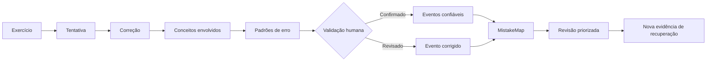
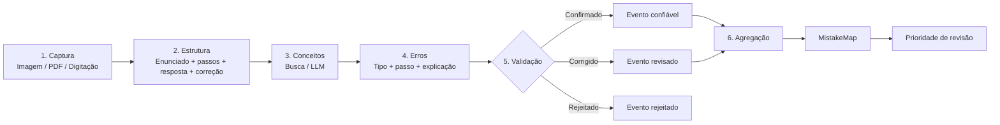
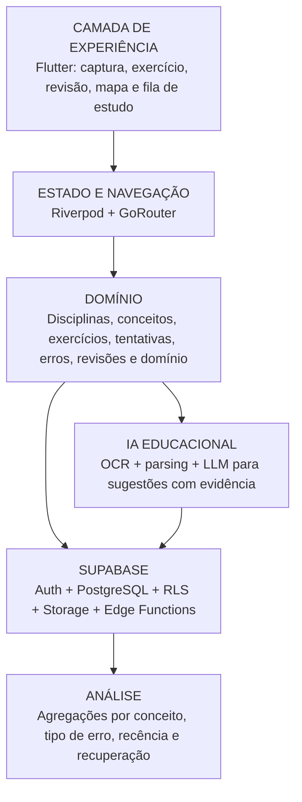
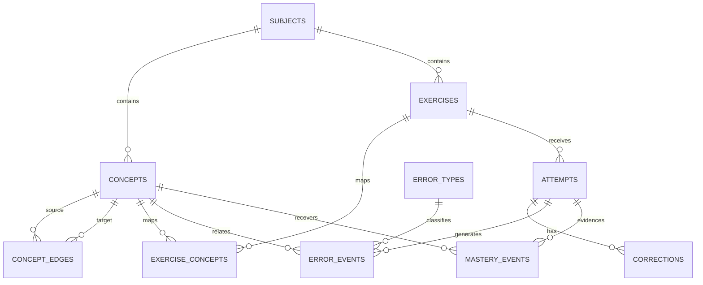
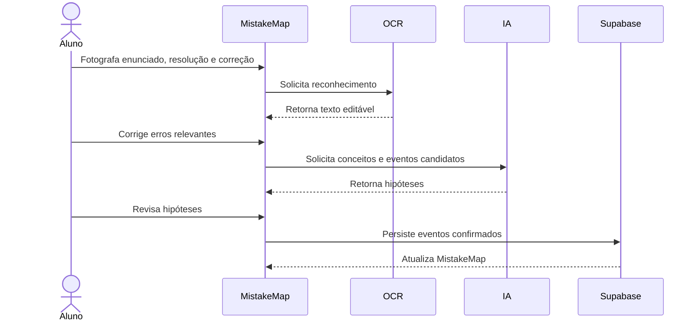
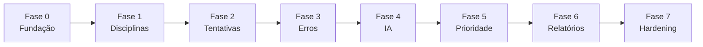

<a id="readme-top"></a>

<div align="center">

# MistakeMap

### Mapa dos Padrões de Erro do Estudante

Plataforma de aprendizagem orientada a erros que transforma exercícios corrigidos em uma estrutura navegável de **conceitos, padrões recorrentes, evidências de recuperação e evolução**.

<br>

[](https://github.com/CFSJCODE/MISTAKEMAP)


<br>

**MistakeMap não é apenas um corretor de certo ou errado.**  
Ele procura responder a uma pergunta mais útil:

> **“Que padrão existe por trás dos meus erros e em quais conceitos esse padrão aparece repetidamente?”**

</div>

<br>

---

<br>

<a id="sobre-o-projeto"></a>

## Sobre o projeto

O **MistakeMap** é um aplicativo que transforma exercícios corrigidos em um **grafo de fragilidades conceituais, tipos de erro, recorrência e evolução**, orientando o processo de revisão sem reduzir o estudante a uma nota.

O estudante pode fotografar exercícios corrigidos ou registrar sua resolução manualmente. A aplicação identifica conceitos envolvidos, sugere padrões de erro — como **negação lógica, unidade, sinal, condição de contorno ou interpretação** — e constrói um mapa temporal após validação do estudante.

A essência do projeto é simples:

<br>

### Fluxo conceitual do MistakeMap



> [!IMPORTANT]
> O **MistakeMap trata o erro como dado de aprendizagem**: um evento contextual que pode ser observado, validado, relacionado a conceitos e acompanhado ao longo do tempo.

<br>

---

<br>

<a id="identificacao-academica"></a>

## Identificação acadêmica

| Campo | Informação |
|:---|:---|
| **Instituição** | Pontifícia Universidade Católica de Minas Gerais — **PUC Minas** |
| **Curso** | Engenharia de Computação |
| **Disciplina** | Projeto Integrado I: Desenvolvimento Móvel |
| **Discentes** | **Cláudio Francisco Dos Santos Júnior** · **Lucas Emanuel Simão Silva** |
| **Orientação** | **Ilo Amy Saldanha Rivero** |
| **Versão do documento** | 1.0 — Agosto de 2026 |

> [!NOTE]
> O projeto é desenvolvido no contexto acadêmico da disciplina **Projeto Integrado I: Desenvolvimento Móvel**, articulando engenharia de software, experiência do usuário, modelagem de dados e inteligência artificial aplicada à aprendizagem.

<br>

---

<br>

<a id="stack-tecnologica"></a>

## Tecnologias

<br>

### Aplicação e arquitetura Flutter

<p>
  
  
  
  
</p>

<br>

### Backend e dados

<p>
  
  
  
  
</p>

<br>

### Inteligência e processamento

<p>
  
  
  
  
</p>

<br>

### Plataformas

<p>
  
  
  
</p>

<br>

### Stack principal

<div align="center">
<table>
  <tr>
    <td align="center" width="145">
      <br>
      <strong>Flutter</strong><br><sub>Interface</sub>
    </td>
    <td align="center" width="145">
      <br>
      <strong>Dart</strong><br><sub>Linguagem</sub>
    </td>
    <td align="center" width="145">
      <br>
      <strong>Supabase</strong><br><sub>Backend</sub>
    </td>
    <td align="center" width="145">
      <br>
      <strong>PostgreSQL</strong><br><sub>Persistência</sub>
    </td>
  </tr>
</table>
</div>

| Camada | Tecnologia | Responsabilidade |
|:---|:---|:---|
| **Frontend** | Flutter + Dart | Captura, edição, revisão e visualização |
| **Estado** | Riverpod | Gerenciamento de estado e injeção de dependências |
| **Navegação** | GoRouter | Rotas e deep links |
| **Backend** | Supabase | Auth, banco, Storage e jobs |
| **Banco** | PostgreSQL | Eventos e grafo conceitual via tabelas |
| **OCR** | Motor compatível | Texto/matemática com revisão manual |
| **IA** | LLM em backend | Sugestão de conceitos e erros |
| **Visualização** | `CustomPaint` / graph library | Mapa conceitual e evolução |

<br>

---

<br>

<a id="metadados"></a>

## Informações do projeto

| Campo | Definição |
|:---|:---|
| **Projeto** | MistakeMap |
| **Documento-base** | Concepção, Arquitetura e Roadmap de Implementação |
| **Contexto de aplicação** | Estudo individual, matemática, física, computação, engenharias e disciplinas baseadas em resolução de problemas |
| **Stack principal** | Flutter + Dart + Supabase/PostgreSQL + Storage + OCR/LLM + grafo conceitual |
| **Plataformas** | Android, Windows e Web |
| **Versão** | **1.0 — Agosto de 2026** |
| **Status** | Concepção / MVP |
| **Repositório** | [`CFSJCODE/MISTAKEMAP`](https://github.com/CFSJCODE/MISTAKEMAP) |

<br>

---

<br>

<a id="sumario"></a>

## Navegação

<details>
<summary><strong>Abrir sumário completo</strong></summary>

<br>

- [Sobre o projeto](#sobre-o-projeto)
- [Identificação acadêmica](#identificacao-academica)
- [Tecnologias](#stack-tecnologica)
- [Informações do projeto](#metadados)
- [Visão Executiva](#visao-executiva)
- [Objetivos](#objetivos)
- [Problema e Cenário de Uso](#problema-e-cenario-de-uso)
- [Escopo Funcional](#escopo-funcional)
- [Regras de Domínio](#regras-de-dominio)
- [Pipeline de Extração e IA](#pipeline-de-extracao-e-ia)
- [Modelagem de Prioridade](#modelagem-de-prioridade)
- [Limites e Salvaguardas](#limites-e-salvaguardas)
- [Arquitetura de Software](#arquitetura-de-software)
- [Modelo de Dados](#modelo-de-dados)
- [Relacionamentos](#relacionamentos)
- [Regras de Integridade](#regras-de-integridade)
- [Segurança e Privacidade](#seguranca-e-privacidade)
- [Experiência do Usuário](#experiencia-do-usuario)
- [Fluxos Operacionais](#fluxos-operacionais)
- [Relatórios e Exportações](#relatorios-e-exportacoes)
- [Arquitetura Flutter](#arquitetura-flutter)
- [Offline e Sincronização](#offline-e-sincronizacao)
- [Roadmap](#roadmap)
- [MVP Recomendado](#mvp-recomendado)
- [Critérios de Aceitação](#criterios-de-aceitacao)
- [Testes e Qualidade](#testes-e-qualidade)
- [Evoluções Futuras](#evolucoes-futuras)
- [Recomendação de Implementação](#recomendacao-de-implementacao)
- [Exemplo de Registro](#exemplo-de-registro)
- [Indicadores de Produto](#indicadores-de-produto)
- [Execução](#execucao)
- [Síntese](#sintese)

</details>

<br>

---

<br>

<a id="visao-executiva"></a>

## Visão Executiva

A proposta é desenvolver um **aplicativo de aprendizagem orientado a erros**.

O estudante registra:

- exercício;
- enunciado;
- solução;
- correção ou gabarito;
- disciplina.

**OCR e IA** extraem a estrutura do material e sugerem conceitos e padrões de falha.

<br>

### Exemplos de hipóteses

- “erra quando a expressão contém negação”;
- “perde unidade na conversão”;
- “aplica fórmula correta com condição inicial errada”;
- “confunde implicação com equivalência”;
- “omite caso de borda”.

O estudante revisa essas classificações. Em seguida, o sistema agrega as ocorrências em um mapa de conceitos e tipos de erro com:

1. **frequência**;
2. **recência**;
3. **importância**;
4. **evidências de recuperação**.

<br>

### Princípio de projeto

> [!NOTE]
> O erro é um **evento contextual**, não um rótulo permanente sobre o aluno.

O sistema deve preservar:

- o exercício;
- a tentativa;
- a evidência;
- o histórico.

Classificações automáticas devem ser tratadas como **sugestões**.

Uma fragilidade pode diminuir quando novos exercícios demonstram domínio.

<br>

---

<br>

<a id="objetivos"></a>

## Objetivos

- [ ] Registrar exercícios corrigidos e a solução produzida pelo estudante.
- [ ] Classificar erros por conceito, operação cognitiva e padrão recorrente.
- [ ] Construir mapa de fragilidades com evidências navegáveis.
- [ ] Priorizar revisão com base em frequência, recência, importância e recuperação.
- [ ] Distinguir erro conceitual, algébrico, aritmético, de unidade, leitura e atenção quando possível.
- [ ] Acompanhar evolução sem transformar o mapa em diagnóstico psicológico ou nota definitiva.

<br>

---

<br>

<a id="problema-e-cenario-de-uso"></a>

## Problema e Cenário de Uso

Ao estudar, o aluno frequentemente corrige uma questão e segue em frente. O histórico de **por que errou** desaparece.

Depois de dezenas de exercícios, padrões relevantes ficam invisíveis:

- sinais trocados;
- hipóteses esquecidas;
- negações mal distribuídas;
- unidades inconsistentes;
- condições de contorno omitidas.

Plataformas tradicionais acumulam acertos e notas, mas nem sempre organizam a **anatomia do erro**.

O MistakeMap cria uma memória de falhas e recuperações ligada ao conteúdo específico.

| Erro observado | Classificação candidata | Conceitos relacionados |
|:---|:---|:---|
| Negou “p e q” como “não p e não q” | Transformação lógica incorreta | Leis de De Morgan, negação, conjunção |
| Usou `3,6` sem converter km/h para m/s | Erro de unidade/conversão | Dimensões, velocidade, SI |
| Esqueceu `x(0)` em solução diferencial | Condição inicial omitida | EDO, solução geral, condição de contorno |
| Aplicou fórmula correta ao caso errado | Erro de seleção/modelagem | Hipóteses, domínio de validade |

> [!WARNING]
> Uma mesma resposta errada pode ter **múltiplas causas possíveis**. Sem explicação do estudante, o sistema deve registrar incerteza em vez de afirmar intenção cognitiva.

<br>

---

<br>

<a id="escopo-funcional"></a>

## Escopo Funcional

| Módulo | Funções principais |
|:---|:---|
| **Disciplinas** | Matérias, unidades, listas e fontes |
| **Conceitos** | Taxonomia/grafo de conceitos e pré-requisitos |
| **Exercícios** | Enunciado, imagem, fonte, dificuldade opcional e conceitos |
| **Tentativas** | Solução do estudante, resposta final, timestamp e tempo opcional |
| **Correções** | Gabarito, comentário do professor e marcações |
| **Erros** | Tipo, conceito, passo afetado, gravidade operacional e validação |
| **Mapa** | Fragilidades por conceito/tipo, evidências e evolução |
| **Revisão** | Fila de exercícios/conceitos prioritários e registro de recuperação |

<br>

---

<br>

<a id="regras-de-dominio"></a>

## Regras de Domínio

1. Erro sugerido por IA permanece `pending` até validação ou confirmação contextual.
2. Um exercício pode envolver vários conceitos.
3. Um erro pode afetar mais de um conceito.
4. Erro corrigido em tentativas futuras **não é apagado**.
5. Sua prioridade diminui pela evidência de recuperação.
6. A ausência de erro em poucos exercícios não prova domínio absoluto.
7. O sistema não deve inferir transtorno, deficiência ou diagnóstico de aprendizagem.
8. Conteúdo de provas/professores pode ter restrições de direitos.
9. Compartilhamento público não faz parte do MVP.

<br>

---

<br>

<a id="pipeline-de-extracao-e-ia"></a>

## Pipeline de Extração e IA

O pipeline deve preservar a **resolução do estudante**. Classificar apenas a resposta final faria o sistema perder informação crítica.

OCR/visão extrai texto e expressões quando possível.

Um LLM compara:

- tentativa;
- correção;
- conceitos da disciplina;

para propor eventos de erro.

Um grafo conceitual conecta tópicos e pré-requisitos.

> [!IMPORTANT]
> A prioridade de revisão é calculada sobre **eventos validados**, não sobre inferências ocultas.

<br>

### Pipeline de processamento



| Etapa | Processamento | Resultado |
|:---|:---|:---|
| **1. Captura** | Imagem/PDF do exercício e solução; OCR ou digitação | Tentativa digitalizada |
| **2. Estrutura** | Separação entre enunciado, passos, resposta e correção | Representação do exercício |
| **3. Conceitos** | Busca/LLM sugere conceitos presentes | Nós candidatos do grafo |
| **4. Erros** | Comparação com correção sugere tipo, passo e explicação | Eventos `pending` |
| **5. Validação** | Aluno/professor confirma, corrige ou rejeita | Eventos confiáveis |
| **6. Agregação** | Frequência, recência e evidência de recuperação atualizam o mapa | Prioridade de revisão |

<br>

---

<br>

<a id="modelagem-de-prioridade"></a>

## Modelagem de Prioridade

Uma prioridade simples pode ser definida como:

$$
P = F \times R \times I \times (1 - M)
$$

onde:

| Variável | Significado |
|:---:|---|
| $P$ | Prioridade de revisão |
| $F$ | Frequência normalizada do erro |
| $R$ | Fator de recência |
| $I$ | Importância do conceito |
| $M$ | Evidência de domínio/recuperação entre `0` e `1` |

> [!NOTE]
> O objetivo é **ordenar a revisão**, não produzir uma nota sobre capacidade intelectual.

```text
Frequência alta
      ×
Recência alta
      ×
Conceito importante
      ×
Baixa recuperação
      =
Alta prioridade de revisão
```

<br>

---

<br>

<a id="limites-e-salvaguardas"></a>

## Limites e Salvaguardas

- Reconhecimento de matemática manuscrita é imperfeito.
- O sistema deve oferecer edição do OCR.
- Entrada manual deve permanecer disponível.
- Comparar soluções exige tolerar métodos alternativos corretos.
- Um erro aparente pode ser erro de transcrição do OCR.
- A causa cognitiva real nem sempre é observável.
- Deve-se utilizar linguagem como **“padrão sugerido”**.
- Priorização deve ser transparente.
- Priorização deve ser ajustável.
- O sistema deve evitar comportamento excessivamente prescritivo.

<br>

---

<br>

<a id="arquitetura-de-software"></a>

## Arquitetura de Software

<br>

### Responsabilidades principais

**Flutter** oferece:

- captura;
- revisão;
- visualização do mapa.

**Supabase** armazena:

- exercícios;
- imagens;
- taxonomia;
- eventos;
- histórico.

OCR/LLM ficam em **backend seguro**.

O grafo pode ser modelado relacionalmente com `concept_edges` no PostgreSQL, sem exigir banco de grafos no MVP.

<br>

### Visão arquitetural



<br>

---

<br>

<a id="modelo-de-dados"></a>

## Modelo de Dados

A modelagem deve ser **event-oriented**:

- cada erro é uma ocorrência ligada a uma tentativa;
- o mapa é uma projeção agregada.

Assim, ajustes na fórmula de prioridade podem recalcular o mapa **sem modificar o histórico**.

| Tabela | Campos essenciais | Observações |
|:---|:---|:---|
| `subjects` | `id`, `user_id`, `name`, `description` | Disciplina |
| `concepts` | `id`, `subject_id`, `name`, `description`, `importance` | Nó conceitual |
| `concept_edges` | `from_concept_id`, `to_concept_id`, `relation` | Pré-requisito/relacionamento |
| `exercises` | `id`, `subject_id`, `source`, `prompt_text`, `difficulty`, `created_at` | Questão |
| `exercise_concepts` | `exercise_id`, `concept_id`, `weight` | Relação N |
| `attempts` | `id`, `exercise_id`, `user_id`, `solution_text`, `answer`, `attempted_at` | Tentativa |
| `corrections` | `id`, `attempt_id`, `reference_text`, `attachment_id`, `reviewed_by` | Gabarito/comentário |
| `error_types` | `id`, `name`, `category`, `description` | Taxonomia de erro |
| `error_events` | `id`, `attempt_id`, `error_type_id`, `concept_id`, `evidence_ref`, `confidence`, `status` | Erro observado/sugerido |
| `mastery_events` | `id`, `concept_id`, `attempt_id`, `outcome`, `created_at` | Evidência de recuperação |

<br>

---

<br>

<a id="relacionamentos"></a>

## Relacionamentos

<br>

### Cardinalidades principais

```text
subjects 1 ---- N concepts

concepts N ---- N concepts
           via concept_edges

exercises N ---- N concepts
            via exercise_concepts

exercises 1 ---- N attempts

attempts 1 ---- 0..N corrections

attempts 1 ---- N error_events

concepts 1 ---- N error_events/mastery_events
```

<br>

### Diagrama entidade-relacionamento



<br>

---

<br>

<a id="regras-de-integridade"></a>

## Regras de Integridade

`error_events.status` deve aceitar:

```text
pending
confirmed
rejected
superseded
```

Além disso:

- [ ] Um evento confirmado deve apontar para tentativa.
- [ ] Um evento confirmado deve possuir evidência/passo suficientemente identificável.
- [ ] `concept_edges` não devem criar ciclos quando `relation = prerequisite`, salvo se o modelo permitir explicitamente.
- [ ] Excluir disciplina exige arquivamento ou cascade controlado.
- [ ] Exclusões não devem quebrar tentativas.
- [ ] Resultados de prioridade são derivados.
- [ ] Resultados de prioridade podem ser recalculados.
- [ ] Eventos históricos permanecem imutáveis.

<br>

---

<br>

<a id="seguranca-e-privacidade"></a>

## Segurança e Privacidade

Cadernos, provas, notas e padrões de desempenho são **dados pessoais educacionais**.

Mesmo em uso individual, o produto deve impedir exposição entre contas e evitar telemetria desnecessária.

| Mecanismo | Aplicação |
|:---|:---|
| **Supabase Auth** | Identidade, sessão, refresh token e provedores OAuth |
| **Row Level Security** | Políticas `SELECT`, `INSERT`, `UPDATE` e `DELETE` avaliadas no PostgreSQL |
| **Storage Policies** | Buckets privados por padrão e URLs temporárias |
| **Service Role** | Restrita a Edge Functions/servidor confiável |
| **Secrets** | Variáveis de ambiente fora do Git |
| **Auditoria** | Alterações críticas com usuário, timestamp e entidade |
| **Dados educacionais** | Sem leaderboard público ou exposição automática de fragilidades |
| **IA** | Enviar somente dados necessários e remover identificadores/metadados não essenciais |

> [!CAUTION]
> A chave `service_role` **nunca deve existir no bundle Flutter**.

<br>

### Regra crítica

> [!IMPORTANT]
> O mapa de erros **pertence ao estudante**.

Compartilhamento com professor/tutor deve ser:

- **explícito**;
- **granular**;
- **revogável**.

Nenhuma fragilidade pode ser publicada automaticamente.

<br>

---

<br>

<a id="experiencia-do-usuario"></a>

## Experiência do Usuário

<br>

### Telas principais

| Tela | Elementos principais |
|:---|:---|
| **Dashboard** | Fila de revisão, conceitos em atenção e evolução recente |
| **Nova questão** | Foto/importação, disciplina e origem |
| **Tentativa** | Solução digitalizada/editável e resposta |
| **Revisão de erro** | Correção, passo afetado, conceitos e sugestões de IA |
| **MistakeMap** | Grafo/heatmap conceitual com filtros por período e tipo |
| **Conceito** | Erros recorrentes, exercícios, recuperações e pré-requisitos |
| **Tipos de erro** | Distribuição por unidade, sinal, lógica, modelagem, leitura etc. |
| **Sessão de revisão** | Lista priorizada e registro de novo desempenho |

<br>

### Diretrizes de interface

- Visual moderno, formal e informacional.
- Evitar aparência de template genérico.
- Responsividade real por breakpoints.
- Desktop com alta densidade de informação.
- Mobile orientado à tarefa.
- Ações críticas exibem estado e consequência.
- Possibilidade de revisão antes da confirmação.
- Contraste adequado.
- Labels textuais.
- Áreas de toque adequadas.
- Navegação por teclado no desktop.
- Estados vazios indicam o próximo passo.
- Evitar linguagem punitiva.
- Preferir **“há recorrência recente em”**.
- Sempre permitir abrir a evidência.
- O mapa deve mostrar melhora e recuperação.

<br>

---

<br>

<a id="fluxos-operacionais"></a>

## Fluxos Operacionais

<br>

### 1. Registrar exercício corrigido



1. Aluno fotografa enunciado, resolução e correção.
2. OCR cria texto editável.
3. Aluno corrige erros relevantes de reconhecimento.
4. Sistema sugere conceitos e eventos de erro.
5. Aluno revisa cada hipótese.
6. Aluno pode adicionar a própria explicação.
7. Eventos confirmados atualizam o mapa.

<br>

### 2. Planejar revisão

1. Motor calcula prioridade dos conceitos com base em eventos confirmados.
2. Aluno abre conceito prioritário.
3. Revisa evidências anteriores.
4. Resolve novo exercício relacionado.
5. Resultado gera `mastery_event` ou novo `error_event`.
6. O mapa muda gradualmente conforme evidência recente.

<br>

### 3. Reclassificar um erro

1. Aluno percebe que o problema não era cálculo, mas unidade.
2. Edita o evento confirmado criando revisão/superseding.
3. Agregações são recalculadas.
4. Histórico preserva a classificação anterior.

<br>

---

<br>

<a id="relatorios-e-exportacoes"></a>

## Relatórios e Exportações

Exportações devem favorecer **metacognição**.

| Saída / integração | Conteúdo ou finalidade |
|:---|:---|
| **PDF — Mapa de revisão** | Conceitos prioritários, erros recorrentes, evidências e exercícios sugeridos pelo próprio acervo |
| **PDF — Evolução por disciplina** | Eventos por período, recuperações e tópicos ainda recorrentes |
| **XLSX/CSV — Eventos** | Tentativas, tipos de erro, conceitos e timestamps |
| **JSON — Grafo conceitual** | Nós, relações e métricas derivadas |
| **Compartilhamento tutor** | Relatório seletivo de conceitos e exercícios, somente com consentimento |

<br>

---

<br>

<a id="arquitetura-flutter"></a>

## Arquitetura Flutter

A base de código deve seguir arquitetura **feature-first**, com separação clara entre apresentação, domínio e dados.

```text
lib/
├── app/
│   ├── router/
│   ├── theme/
│   └── bootstrap/
│
├── core/
│   ├── errors/
│   ├── utils/
│   ├── services/
│   └── widgets/
│
├── features/
│   ├── auth/
│   ├── subjects/
│   ├── concepts/
│   ├── exercises/
│   ├── capture/
│   ├── attempts/
│   ├── corrections/
│   ├── errors/
│   ├── mistake_map/
│   ├── review/
│   ├── reports/
│   └── settings/
│
└── main.dart
```

| Item | Recomendação |
|:---|:---|
| **Gerenciamento de estado** | Riverpod |
| **Injeção de dependências** | Riverpod |
| **Navegação** | GoRouter |
| **Deep links** | GoRouter |
| **Alternativa válida** | Bloc, desde que o projeto adote um único padrão principal |

<br>

---

<br>

<a id="offline-e-sincronizacao"></a>

## Offline e Sincronização

Fotografar e anotar exercício deve funcionar durante aula ou estudo **sem internet**.

> **A IA pode esperar.** O usuário não deve perder a resolução original nem alterações manuais.

<br>

### Recursos previstos

- [ ] Rascunhos locais de exercícios e tentativas.
- [ ] Fila de imagens com hash para upload posterior.
- [ ] Cache do grafo.
- [ ] Cache de eventos recentes.
- [ ] Processamento de IA marcado como pendente.
- [ ] Revisão explícita para conflitos em eventos confirmados.

> [!NOTE]
> No MVP, captura, digitação e consulta básica devem funcionar offline. OCR/LLM e recalculações globais podem ocorrer após sincronização.

<br>

---

<br>

<a id="roadmap"></a>

## Roadmap

| Fase | Entregas | Critério de conclusão |
|:---|:---|:---|
| **Fase 0 — Fundação** | Flutter, Supabase, Auth e Storage | Login e dados privados |
| **Fase 1 — Disciplinas** | Conceitos, relações e exercícios | Grafo manual navegável |
| **Fase 2 — Tentativas** | Soluções, correções e anexos | Histórico de estudo completo |
| **Fase 3 — Erros** | Taxonomia e eventos manuais | Mapa funciona sem IA |
| **Fase 4 — IA** | OCR, conceitos e erros sugeridos | Sugestões revisáveis com evidência |
| **Fase 5 — Prioridade** | Agregação, recência e `mastery_events` | Fila de revisão explicável |
| **Fase 6 — Relatórios** | PDF/CSV e compartilhamento seletivo | Portabilidade garantida |
| **Fase 7 — Hardening** | RLS, testes e avaliação educacional | Release estável |

<br>

### Visão do roadmap



<br>

---

<br>

<a id="mvp-recomendado"></a>

## MVP Recomendado

O MVP deve permitir que o estudante **registre e classifique erros manualmente**.

> [!TIP]
> A IA entra como **acelerador**, não como dependência estrutural do valor inicial do produto.

- [ ] Disciplinas, conceitos e relações.
- [ ] Exercícios/tentativas com imagens.
- [ ] Taxonomia inicial de erros.
- [ ] Classificação manual + sugestão de IA.
- [ ] MistakeMap agregado.
- [ ] Fila de revisão por prioridade.
- [ ] PDF/CSV de histórico.

<br>

---

<br>

<a id="criterios-de-aceitacao"></a>

## Critérios de Aceitação

| ID | Critério verificável |
|:---:|---|
| **AC-01** | Nenhum erro sugerido pela IA torna-se confirmado sem revisão configurada do usuário |
| **AC-02** | Todo evento de erro confirmado aponta para uma tentativa |
| **AC-03** | Usuário pode abrir a evidência associada a um nó prioritário |
| **AC-04** | Novo desempenho positivo pode reduzir prioridade sem apagar erros antigos |
| **AC-05** | OCR editado pelo usuário é preservado e não sobrescrito silenciosamente |
| **AC-06** | Conceitos de outro usuário não aparecem na conta atual |
| **AC-07** | A fórmula de prioridade é explicável em termos de fatores exibíveis |
| **AC-08** | Compartilhamento de relatório não inclui exercícios não selecionados |
| **AC-09** | O aplicativo não gera diagnósticos de aprendizagem |
| **AC-10** | A chave `service_role` não existe no bundle Flutter |

<br>

---

<br>

<a id="testes-e-qualidade"></a>

## Testes e Qualidade

<details open>
<summary><strong>Testes unitários</strong></summary>

<br>

- Regras de domínio.
- Validações.
- Funções de pontuação/cálculo.
- Cálculo de prioridade.
- Decaimento temporal.

</details>

<details>
<summary><strong>Testes de widget</strong></summary>

<br>

- Formulários.
- Navegação.
- Filtros.
- Estados vazios.
- Mensagens de erro.

</details>

<details>
<summary><strong>Testes de integração</strong></summary>

<br>

- Autenticação.
- Banco.
- Storage.
- Operações transacionais no Supabase.

</details>

<details>
<summary><strong>Testes de segurança</strong></summary>

<br>

- RLS com usuários autorizados.
- RLS com usuários não autorizados.
- Isolamento entre contas.

</details>

<details>
<summary><strong>Concorrência e resiliência</strong></summary>

<br>

- Testes de concorrência nas operações que alteram reserva, saldo, estado ou histórico.
- Recuperação de falhas de rede.
- Repetição idempotente de comandos.

</details>

<details>
<summary><strong>Observabilidade</strong></summary>

<br>

- Monitoramento sem registrar tokens.
- Não registrar documentos privados.
- Não registrar dados pessoais desnecessários.

</details>

<details>
<summary><strong>Avaliação da IA</strong></summary>

<br>

- Testes com soluções alternativas corretas.
- Avaliação humana de amostra de eventos.
- Medição da precisão de conceitos sugeridos.
- Medição da precisão de tipos sugeridos.

</details>

<br>

---

<br>

<a id="evolucoes-futuras"></a>

## Evoluções Futuras

| Evolução | Valor agregado |
|:---|:---|
| **Integração com Anki/flashcards** | Gerar revisão a partir de padrões confirmados |
| **Professor/tutor** | Fluxo opcional de validação colaborativa |
| **Geração de exercícios** | Criar variações direcionadas ao padrão de erro com critérios de segurança acadêmica |
| **LaTeX/Math OCR** | Aprimorar captura de expressões matemáticas |
| **RAG das notas** | Conectar erros aos trechos de teoria do próprio material do aluno |
| **Análise longitudinal** | Comparar semestres e identificar padrões recuperados ou reincidentes |

<details>
<summary><strong>Integração com Anki/flashcards</strong></summary>

<br>

Gerar revisão a partir de padrões confirmados.

</details>

<details>
<summary><strong>Professor/tutor</strong></summary>

<br>

Fluxo opcional de validação colaborativa.

</details>

<details>
<summary><strong>Geração de exercícios</strong></summary>

<br>

Criar variações direcionadas ao padrão de erro com critérios de segurança acadêmica.

</details>

<details>
<summary><strong>LaTeX/Math OCR</strong></summary>

<br>

Aprimorar captura de expressões matemáticas.

</details>

<details>
<summary><strong>RAG das notas</strong></summary>

<br>

Conectar erros aos trechos de teoria do próprio material do aluno.

</details>

<details>
<summary><strong>Análise longitudinal</strong></summary>

<br>

Comparar semestres e identificar padrões recuperados ou reincidentes.

</details>

<br>

---

<br>

<a id="recomendacao-de-implementacao"></a>

## Recomendação de Implementação

> [!IMPORTANT]
> **Desenvolver a taxonomia e o modelo de eventos antes da IA.**

Um sistema que sabe registrar:

- onde o erro ocorreu;
- qual conceito estava envolvido;
- por que o aluno acredita que errou;

já produz valor.

A inteligência automática deve **reduzir o trabalho de classificação**, não substituir o ato metacognitivo de revisar a própria solução.

<br>

---

<br>

<a id="exemplo-de-registro"></a>

## Exemplo de Registro

```yaml
disciplina: "Lógica Proposicional"
exercicio: "EX-00472"
tentativa: "25/08/2026 20:14"

erro_confirmado:
  descricao: "Negação incorreta de conjunção"
  tipo: "Transformação lógica"

conceitos:
  - Negação
  - Conjunção
  - Leis de De Morgan

evidencia:
  referencia: "Passo 3 da resolução"

recorrencia:
  eventos: 3
  janela: "últimos 21 dias"

prioridade:
  nivel: "Alta"
  justificativa_visivel: true
```

<br>

---

<br>

<a id="indicadores-de-produto"></a>

## Indicadores de Produto

| Indicador | Interpretação |
|:---|:---|
| **Recorrência por conceito** | Frequência de eventos confirmados em janela definida |
| **Taxa de recuperação** | Conceitos com `mastery_events` após erros anteriores |
| **Precisão da sugestão** | Percentual de eventos IA aceitos sem alteração |
| **Tempo até revisão** | Intervalo entre erro e nova prática relacionada |
| **Diversidade de erro** | Distribuição entre tipos para evitar foco excessivo em uma única métrica |

<br>

---

<br>

<a id="execucao"></a>

## Execução

> [!NOTE]
> O documento de concepção define a arquitetura e o roadmap, mas não fornece instruções formais de build ou implantação. Os comandos abaixo representam apenas o **fluxo padrão esperado para um projeto Flutter**.

<br>

### Pré-requisitos

- [ ] Flutter SDK
- [ ] Dart SDK
- [ ] Projeto Supabase configurado
- [ ] Ambiente compatível com a plataforma de destino

<br>

### 1. Clonar o repositório

```bash
git clone https://github.com/CFSJCODE/MISTAKEMAP.git
cd MISTAKEMAP
```

<br>

### 2. Instalar dependências

```bash
flutter pub get
```

<br>

### 3. Verificar o ambiente

```bash
flutter doctor
```

<br>

### 4. Executar

```bash
flutter run
```

<br>

---

<br>

<a id="sintese"></a>

## Síntese

> **MistakeMap trata o erro como dado de aprendizagem:** não um ponto final vermelho, mas um sinal que, quando conectado a outros sinais, revela onde a próxima revisão pode produzir maior retorno.

<br>

---

<br>

<p align="right"><a href="#readme-top">↑ Voltar ao topo</a></p>

<br>

<h3 align="center">MistakeMap</h3>

<p align="center"><strong>O erro não é o fim da resolução. É um sinal.</strong></p>

<p align="center">
  Projeto Integrado I: Desenvolvimento Móvel · Engenharia de Computação · PUC Minas<br>
  Cláudio Francisco Dos Santos Júnior · Lucas Emanuel Simão Silva<br>
  Orientação: Ilo Amy Saldanha Rivero
</p>

<p align="center">
  
  
  
  
</p>

<p align="center"><sub>Versão 1.0 · Agosto de 2026</sub></p>
