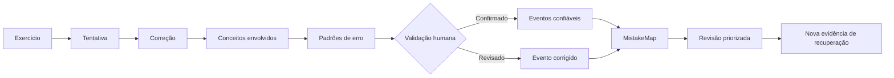
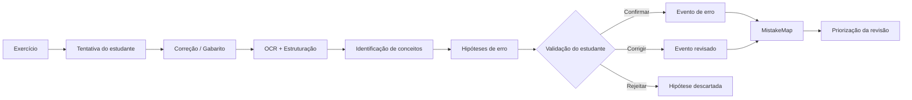
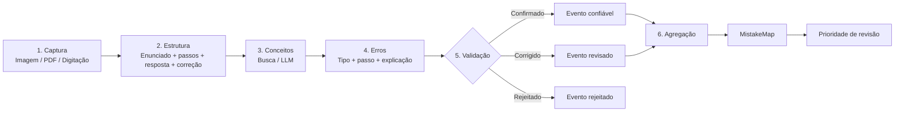
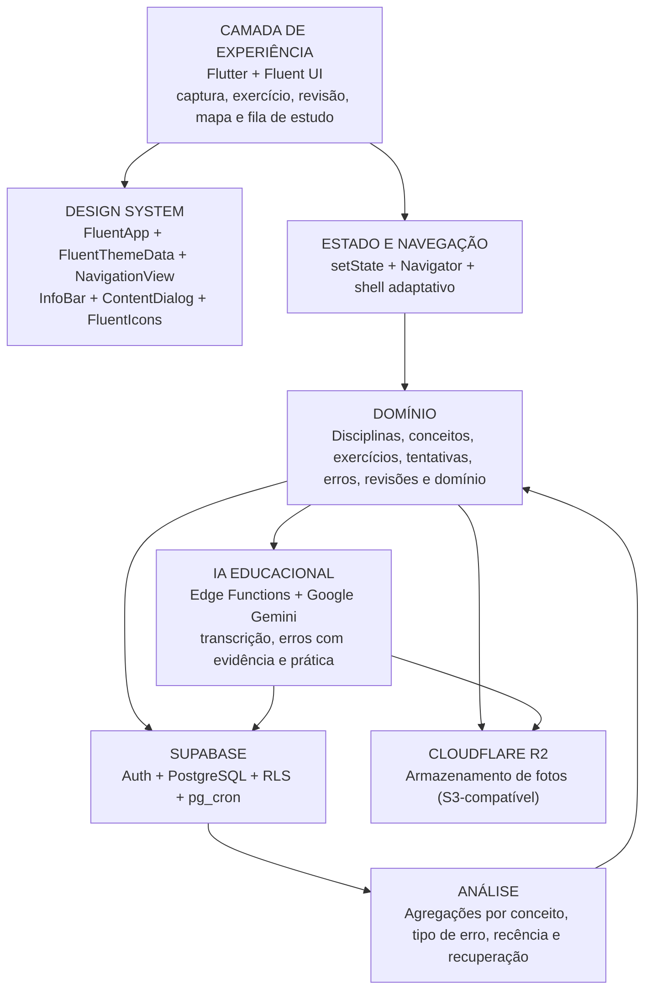
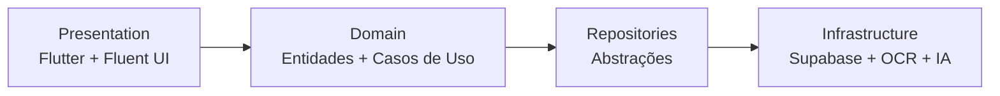
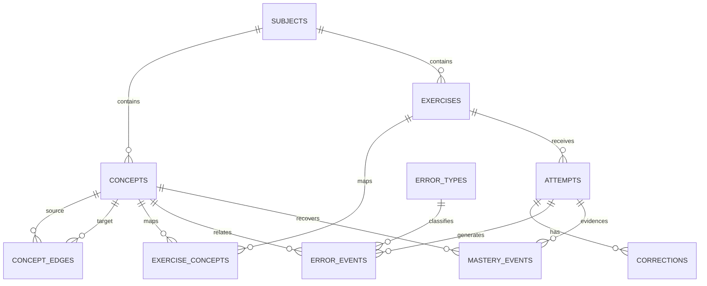
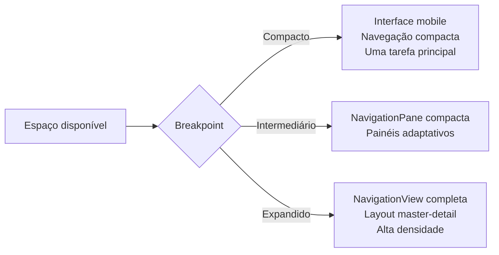
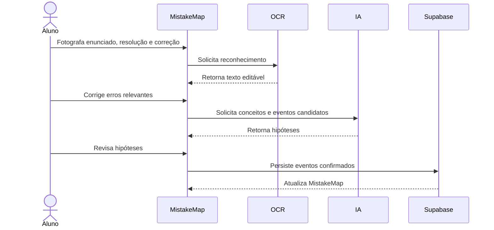
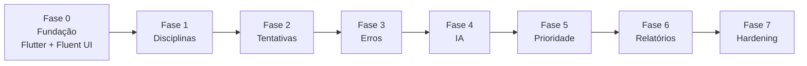
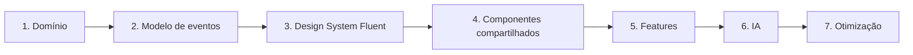

<a id="readme-top"></a>

<div align="center">

# MistakeMap

### Mapa dos Padrões de Erro do Estudante

Plataforma de aprendizagem orientada a erros que transforma exercícios corrigidos em uma estrutura navegável de **conceitos, padrões recorrentes, evidências de recuperação e evolução**.

[](https://github.com/CFSJCODE/MISTAKEMAP)


[](https://github.com/CFSJCODE/MistakeMap/actions/workflows/ci.yml)

**MistakeMap não é apenas um corretor de certo ou errado.**  
Ele procura responder a uma pergunta mais útil:

> **“Que padrão existe por trás dos meus erros e em quais conceitos esse padrão aparece repetidamente?”**

</div>

---

<a id="sobre-o-projeto"></a>

## Sobre o projeto

O **MistakeMap** é um aplicativo que transforma exercícios corrigidos em um **grafo de fragilidades conceituais, tipos de erro, recorrência e evolução**, orientando o processo de revisão sem reduzir o estudante a uma nota.

O estudante pode fotografar exercícios corrigidos ou registrar sua resolução manualmente. A aplicação identifica conceitos envolvidos, sugere padrões de erro — como **negação lógica, unidade, sinal, condição de contorno ou interpretação** — e constrói um mapa temporal após validação do estudante.

A essência do projeto é simples:

### Fluxo conceitual do MistakeMap


```mermaid
flowchart LR
    A["Exercício"] --> B["Tentativa"]
    B --> C["Correção"]
    C --> D["Conceitos envolvidos"]
    D --> E["Padrões de erro"]
    E --> F{"Validação humana"}
    F -->|Confirmado| G["Eventos confiáveis"]
    F -->|Revisado| H["Evento corrigido"]
    G --> I["MistakeMap"]
    H --> I
    I --> J["Revisão priorizada"]
    J --> K["Nova evidência de recuperação"]
```

> [!IMPORTANT]
> O **MistakeMap trata o erro como dado de aprendizagem**: um evento contextual que pode ser observado, validado, relacionado a conceitos e acompanhado ao longo do tempo.

---

<a id="identificacao-academica"></a>

## Identificação acadêmica

| Campo | Informação |
|:---|:---|
| **Instituição** | Pontifícia Universidade Católica de Minas Gerais — **PUC Minas** |
| **Curso** | Engenharia de Computação |
| **Disciplina** | Projeto Integrado I: Desenvolvimento Móvel |
| **Discentes** | **Cláudio Francisco Dos Santos Júnior** · **Lucas Emanuel Simão Silva** |
| **Orientação** | **Ilo Amy Saldanha Rivero** |
| **Versão do documento** | 1.1 — Outubro de 2026 |

> [!NOTE]
> O projeto é desenvolvido no contexto acadêmico da disciplina **Projeto Integrado I: Desenvolvimento Móvel**, articulando engenharia de software, experiência do usuário, modelagem de dados e inteligência artificial aplicada à aprendizagem.

---

<a id="stack-tecnologica"></a>

## Tecnologias

### Aplicação, arquitetura e interface Flutter

<p>
  
  
  
  
  
</p>

### Design System

<p>
  
  
  
  
</p>

O **MistakeMap utiliza Fluent UI como Design System oficial da camada de apresentação**.

A interface deve utilizar, sempre que aplicável, os componentes e princípios do ecossistema Fluent:

- `FluentApp`;
- `FluentThemeData`;
- `NavigationView`;
- `NavigationPane`;
- `CommandBar`;
- `InfoBar`;
- `ContentDialog`;
- `Flyout`;
- `FluentIcons`;
- `FilledButton`;
- `Button`;
- `TextBox`;
- `ComboBox`;
- `AutoSuggestBox`;
- `ProgressRing`;
- `ProgressBar`;
- `Acrylic`, quando houver justificativa funcional;
- tipografia, hierarquia, profundidade, espaçamento e estados coerentes com o **Fluent Design System**.

> [!IMPORTANT]
> **Material Design não constitui a linguagem visual principal do MistakeMap.**
>
> O projeto utiliza Flutter como framework de interface, porém sua identidade visual e seus componentes de apresentação são baseados em **Fluent UI**.
>
> A única exceção são as telas de análise por IA (envio, mapa de erros, correção e prática), que rodam em uma rota Material 3 isolada (`AiMaterialShell`) para usar gráficos e formulários. Elas recebem os mesmos tokens de cor, raio e movimento da marca (`lib/theme/`), e nenhuma tela Fluent depende dessa rota.

### Backend e dados

<p>
  
  
  
  
  
</p>

### Inteligência e processamento

<p>
  
  
  
  
  
</p>

### Plataformas

<p>
  
  
  
</p>

### Stack principal

<div align="center">

<table>
  <tr>
    <td align="center" width="130">
      <br>
      <strong>Flutter</strong><br><sub>Framework</sub>
    </td>
    <td align="center" width="130">
      <br>
      <strong>Dart</strong><br><sub>Linguagem</sub>
    </td>
    <td align="center" width="130">
      <br>
      <strong>Fluent UI</strong><br><sub>Design System</sub>
    </td>
    <td align="center" width="130">
      <br>
      <strong>Supabase</strong><br><sub>Backend</sub>
    </td>
    <td align="center" width="130">
      <br>
      <strong>PostgreSQL</strong><br><sub>Persistência</sub>
    </td>
  </tr>
</table>

</div>

| Camada | Tecnologia | Responsabilidade |
|:---|:---|:---|
| **Frontend** | Flutter + Dart | Captura, edição, revisão e visualização |
| **Design System** | `fluent_ui` | Linguagem visual e componentes da aplicação |
| **Aplicação raiz** | `FluentApp` | Configuração global da camada visual |
| **Tema** | `FluentThemeData` | Cores, brilho, tipografia e comportamento visual |
| **Iconografia** | `WindowsIcons` (`fluent_ui`) | Iconografia consistente com Fluent Design |
| **Camada flutuante** | `liquid_glass_widgets` | Barras, botões da barra e avisos (toasts) |
| **Telas de IA** | Material 3 isolado (`AiMaterialShell`) | Envio, mapa de erros, correção e prática |
| **Estado** | `StatefulWidget` + `setState` | Estado local por tela, sem framework externo |
| **Navegação** | `Navigator` + shell adaptativo | Barra inferior no celular e menu lateral a partir de 840 px |
| **Autenticação** | Supabase Auth | E-mail e senha, e login com Google (OAuth) |
| **Backend** | Supabase | Auth, banco, Edge Functions e jobs (`pg_cron` + `pg_net`) |
| **Banco** | PostgreSQL | Eventos e grafo conceitual via tabelas, com RLS |
| **Armazenamento de arquivos** | Cloudflare R2 | Fotos de exercícios via URL pré-assinada (10GB grátis, compatível S3, egress zero) |
| **OCR** | Google Gemini (multimodal) | Transcrição da foto com revisão manual |
| **IA** | Gemini nas Edge Functions | Sugestão de conceitos, erros e exercícios de prática |
| **Visualização** | `CustomPaint` | Grafo de conceitos e barras de frequência |

---

<a id="metadados"></a>

## Informações do projeto

| Campo | Definição |
|:---|:---|
| **Projeto** | MistakeMap |
| **Documento-base** | Concepção, Arquitetura e Roadmap de Implementação |
| **Contexto de aplicação** | Estudo individual, matemática, física, computação, engenharias e disciplinas baseadas em resolução de problemas |
| **Stack principal** | Flutter + Dart + Fluent UI + Supabase/PostgreSQL + Edge Functions + Cloudflare R2 + Gemini + grafo conceitual |
| **Design System** | Fluent UI / Fluent Design |
| **Pacote de interface** | `fluent_ui` + `liquid_glass_widgets` |
| **Plataformas** | Android, Windows e Web |
| **Versão** | **1.0.0 — Outubro de 2026** |
| **Status** | MVP funcional |
| **Repositório** | [`CFSJCODE/MISTAKEMAP`](https://github.com/CFSJCODE/MISTAKEMAP) |

---

<a id="estado-atual"></a>

## Estado atual da implementação

O núcleo do MVP está implementado e publicado: o estudante cadastra exercícios, envia a foto da tentativa, recebe uma análise de erros com evidências, navega pelo mapa de erros e pratica com exercícios direcionados.

| Área | Situação | Onde está |
|:---|:---:|:---|
| **Login e cadastro** (e-mail/senha e Google) | ✅ | `appmistakemap/lib/main.dart`, `lib/auth/` |
| **Exercícios** (criar, listar, editar, excluir e detalhar) | ✅ | `appmistakemap/lib/main.dart` |
| **Envio da foto** para a R2 via URL pré-assinada, com SHA-256 | ✅ | `lib/ai/analysis_repository.dart`, função `upload-url` |
| **Análise por IA** (transcrição, erros por categoria, conceito, evidência e confiança) | ✅ | função `analyze-attempt`, `lib/ai/insights_view.dart` |
| **Mapa de erros** (grafo de conceitos e frequência por categoria) | ✅ | `lib/ai/insights_view.dart` |
| **Exercícios de prática** gerados a partir dos erros (3 a 5 por pedido) | ✅ | função `generate-practice` |
| **Fila em lote** processada pelo `pg_cron` | ✅ | função `process-batch` |
| **Painel administrativo** (papéis, uso e cotas da IA por modelo) | ✅ | `lib/admin/`, tela Admin |
| **Layout adaptativo** (celular, tablet, desktop, dobráveis e telas duplas) | ✅ | `lib/layout/` |
| **Fórmula de prioridade** $P = F \times R \times I \times (1 - M)$ | 🔜 | prevista como função PostgreSQL |
| **Validação humana** dos erros sugeridos (confirmar, corrigir, rejeitar) | 🔜 | hoje a análise é exibida, ainda sem confirmação por evento |
| **Modo offline** e fila local de envio | 🔜 | não iniciado |
| **Relatórios** PDF/CSV | 🔜 | não iniciado |

A taxonomia de erros usada pela IA tem 7 categorias: `calculo`, `conceito`, `sinal`, `interpretacao`, `procedimento`, `unidade` e `outro`. Cada usuário tem um limite diário de análises e de pedidos de prática, controlado no banco (`ai_daily_usage`).

> [!NOTE]
> O worker Rust em `worker/` foi a primeira implementação do pipeline e está **arquivado**: desde 28/09/2026 o processamento roda nas Supabase Edge Functions. Os detalhes de backend, deploy e pendências estão em [`BACKEND.md`](../BACKEND.md), e as migrações em [`appmistakemap/database/README.md`](../appmistakemap/database/README.md).

---

<a id="sumario"></a>

## Navegação

<details>
<summary><strong>Abrir sumário completo</strong></summary>

- [Sobre o projeto](#sobre-o-projeto)
- [Identificação acadêmica](#identificacao-academica)
- [Tecnologias](#stack-tecnologica)
- [Informações do projeto](#metadados)
- [Estado atual da implementação](#estado-atual)
- [Visão Executiva](#visao-executiva)
- [Objetivos](#objetivos)
- [Problema e Cenário de Uso](#problema-e-cenario-de-uso)
- [Escopo Funcional](#escopo-funcional)
- [Regras de Domínio](#regras-de-dominio)
- [Pipeline de Extração e IA](#pipeline-de-extracao-e-ia)
- [Modelagem de Prioridade](#modelagem-de-prioridade)
- [Limites e Salvaguardas](#limites-e-salvaguardas)
- [Arquitetura de Software](#arquitetura-de-software)
- [Modelo de Dados](#modelo-de-dados)
- [Relacionamentos](#relacionamentos)
- [Regras de Integridade](#regras-de-integridade)
- [Segurança e Privacidade](#seguranca-e-privacidade)
- [Experiência do Usuário](#experiencia-do-usuario)
- [Fluent UI](#fluent-ui)
- [Fluxos Operacionais](#fluxos-operacionais)
- [Relatórios e Exportações](#relatorios-e-exportacoes)
- [Arquitetura Flutter](#arquitetura-flutter)
- [Offline e Sincronização](#offline-e-sincronizacao)
- [Roadmap](#roadmap)
- [MVP Recomendado](#mvp-recomendado)
- [Critérios de Aceitação](#criterios-de-aceitacao)
- [Testes e Qualidade](#testes-e-qualidade)
- [Evoluções Futuras](#evolucoes-futuras)
- [Recomendação de Implementação](#recomendacao-de-implementacao)
- [Exemplo de Registro](#exemplo-de-registro)
- [Indicadores de Produto](#indicadores-de-produto)
- [Execução](#execucao)
- [Síntese](#sintese)

</details>

---

<a id="visao-executiva"></a>

## Visão Executiva

O **MistakeMap** é uma plataforma de aprendizagem orientada a erros que transforma exercícios corrigidos em **evidências estruturadas de aprendizagem**, permitindo identificar recorrências, relacionar falhas a conceitos e acompanhar sinais de recuperação ao longo do tempo.

> [!IMPORTANT]
> O objetivo do MistakeMap não é apenas registrar **se uma resposta está correta ou incorreta**, mas compreender **quais padrões de erro aparecem, onde aparecem e como evoluem com novas tentativas**.

### Como o sistema funciona

O estudante registra uma atividade juntamente com sua resolução e respectiva correção. A partir desse material, o sistema estrutura os dados, identifica conceitos relacionados e propõe hipóteses de erro que posteriormente devem ser revisadas pelo próprio estudante.

| Entrada | Finalidade |
|:---|:---|
| **Exercício** | Identificar a atividade analisada |
| **Enunciado** | Preservar o contexto e os requisitos do problema |
| **Solução** | Registrar o raciocínio e os passos executados pelo estudante |
| **Correção / Gabarito** | Estabelecer uma referência para comparação |
| **Disciplina** | Contextualizar conceitos, relações e taxonomias |


```mermaid
flowchart LR
    A["Exercício"] --> B["Tentativa do estudante"]
    B --> C["Correção / Gabarito"]
    C --> D["OCR + Estruturação"]
    D --> E["Identificação de conceitos"]
    E --> F["Hipóteses de erro"]
    F --> G{"Validação do estudante"}
    G -->|Confirmar| H["Evento de erro"]
    G -->|Corrigir| I["Evento revisado"]
    G -->|Rejeitar| J["Hipótese descartada"]
    H --> K["MistakeMap"]
    I --> K
    K --> L["Priorização da revisão"]
```

### Papel do OCR e da Inteligência Artificial

O **OCR** transforma imagens, documentos e resoluções manuscritas em conteúdo editável, enquanto a **Inteligência Artificial** auxilia na interpretação da tentativa e na identificação de conceitos e possíveis padrões de falha.

A IA pode analisar conjuntamente:

- enunciado;
- resolução do estudante;
- resposta final;
- correção ou gabarito;
- conceitos associados à disciplina;
- histórico de ocorrências semelhantes.

> [!NOTE]
> As classificações produzidas automaticamente são tratadas como **hipóteses**, e não como conclusões definitivas. A validação humana permanece parte central do processo.

### Exemplos de hipóteses de erro

| Situação observada | Hipótese sugerida | Conceitos relacionados |
|:---|:---|:---|
| Negação aplicada incorretamente | **Erro em transformação lógica** | Negação, conjunção, Leis de De Morgan |
| Conversão de unidades ignorada | **Erro de unidade** | Sistema Internacional, análise dimensional |
| Condição inicial não aplicada | **Omissão de condição** | EDO, condições iniciais e de contorno |
| Fórmula correta usada no contexto errado | **Erro de modelagem** | Hipóteses, domínio de validade |
| Implicação tratada como equivalência | **Erro conceitual de lógica** | Implicação, equivalência |
| Caso extremo ou limite desconsiderado | **Omissão de caso de borda** | Restrições, domínio, validação |

Outros padrões que podem emergir incluem:

- “erra quando a expressão contém negação”;
- “perde unidade durante conversões”;
- “aplica a fórmula correta com condição inicial incorreta”;
- “confunde implicação com equivalência”;
- “omite casos de borda ou condições especiais”.

### Da ocorrência isolada ao padrão

Um único erro possui pouco valor analítico quando observado isoladamente. O MistakeMap ganha significado ao relacionar **múltiplos eventos ao longo do tempo**.

```text
Erro isolado
    ↓
Evento contextualizado
    ↓
Conceito relacionado
    ↓
Recorrência observada
    ↓
Padrão confirmado
    ↓
Prioridade de revisão
    ↓
Nova tentativa
    ↓
Evidência de recuperação
```

O estudante revisa as classificações sugeridas e, após a validação, o sistema agrega as ocorrências considerando quatro dimensões principais:

| Fator | Pergunta respondida | Impacto |
|:---|:---|:---|
| **Frequência** | Quantas vezes esse padrão ocorreu? | Recorrências aumentam a relevância |
| **Recência** | Quão recentemente voltou a ocorrer? | Eventos recentes recebem maior atenção |
| **Importância** | Qual é o peso do conceito na estrutura da disciplina? | Conceitos fundamentais podem receber maior prioridade |
| **Recuperação** | Existem evidências recentes de domínio? | Evidências positivas reduzem gradualmente a prioridade |

### Princípio de projeto

> [!NOTE]
> O erro é um **evento contextual**, não um rótulo permanente sobre o estudante.

O sistema deve preservar a cadeia completa de evidências:

```text
Exercício
   ↓
Tentativa
   ↓
Correção
   ↓
Hipótese
   ↓
Validação
   ↓
Evento
   ↓
Evolução
```

Isso significa que:

- classificações automáticas são sempre tratadas como **sugestões**;
- erros históricos não são apagados quando ocorre recuperação;
- novas tentativas podem diminuir a prioridade de uma fragilidade;
- diferentes métodos corretos devem ser aceitos;
- nenhuma ocorrência isolada deve ser utilizada como diagnóstico;
- toda prioridade deve possuir justificativa rastreável até suas evidências.

> [!TIP]
> O MistakeMap procura transformar o histórico de resolução em uma **memória navegável de aprendizagem**, na qual erros antigos deixam de ser apenas falhas registradas e passam a funcionar como pontos de referência para medir evolução.

---

<a id="objetivos"></a>

## Objetivos

- [x] Registrar exercícios corrigidos e a solução produzida pelo estudante.
- [x] Classificar erros por conceito, operação cognitiva e padrão recorrente.
- [x] Construir mapa de fragilidades com evidências navegáveis.
- [ ] Priorizar revisão com base em frequência, recência, importância e recuperação.
- [x] Distinguir erro conceitual, algébrico, aritmético, de unidade, leitura e atenção quando possível.
- [ ] Acompanhar evolução sem transformar o mapa em diagnóstico psicológico ou nota definitiva.

---

<a id="problema-e-cenario-de-uso"></a>

## Problema e Cenário de Uso

Ao estudar, o aluno frequentemente corrige uma questão e segue em frente. O histórico de **por que errou** desaparece.

Depois de dezenas de exercícios, padrões relevantes ficam invisíveis:

- sinais trocados;
- hipóteses esquecidas;
- negações mal distribuídas;
- unidades inconsistentes;
- condições de contorno omitidas.

Plataformas tradicionais acumulam acertos e notas, mas nem sempre organizam a **anatomia do erro**.

O MistakeMap cria uma memória de falhas e recuperações ligada ao conteúdo específico.

| Erro observado | Classificação candidata | Conceitos relacionados |
|:---|:---|:---|
| Negou “p e q” como “não p e não q” | Transformação lógica incorreta | Leis de De Morgan, negação, conjunção |
| Usou `3,6` sem converter km/h para m/s | Erro de unidade/conversão | Dimensões, velocidade, SI |
| Esqueceu `x(0)` em solução diferencial | Condição inicial omitida | EDO, solução geral, condição de contorno |
| Aplicou fórmula correta ao caso errado | Erro de seleção/modelagem | Hipóteses, domínio de validade |

> [!WARNING]
> Uma mesma resposta errada pode ter **múltiplas causas possíveis**. Sem explicação do estudante, o sistema deve registrar incerteza em vez de afirmar intenção cognitiva.

---

<a id="escopo-funcional"></a>

## Escopo Funcional

| Módulo | Funções principais |
|:---|:---|
| **Disciplinas** | Matérias, unidades, listas e fontes |
| **Conceitos** | Taxonomia/grafo de conceitos e pré-requisitos |
| **Exercícios** | Enunciado, imagem, fonte, dificuldade opcional e conceitos |
| **Tentativas** | Solução do estudante, resposta final, timestamp e tempo opcional |
| **Correções** | Gabarito, comentário do professor e marcações |
| **Erros** | Tipo, conceito, passo afetado, gravidade operacional e validação |
| **Mapa** | Fragilidades por conceito/tipo, evidências e evolução |
| **Revisão** | Fila de exercícios/conceitos prioritários e registro de recuperação |

---

<a id="regras-de-dominio"></a>

## Regras de Domínio

1. Erro sugerido por IA permanece `pending` até validação ou confirmação contextual.
2. Um exercício pode envolver vários conceitos.
3. Um erro pode afetar mais de um conceito.
4. Erro corrigido em tentativas futuras **não é apagado**.
5. Sua prioridade diminui pela evidência de recuperação.
6. A ausência de erro em poucos exercícios não prova domínio absoluto.
7. O sistema não deve inferir transtorno, deficiência ou diagnóstico de aprendizagem.
8. Conteúdo de provas/professores pode ter restrições de direitos.
9. Compartilhamento público não faz parte do MVP.

---

<a id="pipeline-de-extracao-e-ia"></a>

## Pipeline de Extração e IA

O pipeline deve preservar a **resolução do estudante**. Classificar apenas a resposta final faria o sistema perder informação crítica.

OCR/visão extrai texto e expressões quando possível.

Um LLM compara:

- tentativa;
- correção;
- conceitos da disciplina;

para propor eventos de erro.

Um grafo conceitual conecta tópicos e pré-requisitos.

> [!IMPORTANT]
> A prioridade de revisão é calculada sobre **eventos validados**, não sobre inferências ocultas.

### Pipeline de processamento


```mermaid
flowchart LR
    A["1. Captura<br/>Imagem / PDF / Digitação"] --> B["2. Estrutura<br/>Enunciado + passos + resposta + correção"]
    B --> C["3. Conceitos<br/>Busca / LLM"]
    C --> D["4. Erros<br/>Tipo + passo + explicação"]
    D --> E{"5. Validação"}
    E -->|Confirmado| F["Evento confiável"]
    E -->|Corrigido| G["Evento revisado"]
    E -->|Rejeitado| H["Evento rejeitado"]
    F --> I["6. Agregação"]
    G --> I
    I --> J["MistakeMap"]
    J --> K["Prioridade de revisão"]
```

| Etapa | Processamento | Resultado |
|:---|:---|:---|
| **1. Captura** | Imagem/PDF do exercício e solução; OCR ou digitação | Tentativa digitalizada |
| **2. Estrutura** | Separação entre enunciado, passos, resposta e correção | Representação do exercício |
| **3. Conceitos** | Busca/LLM sugere conceitos presentes | Nós candidatos do grafo |
| **4. Erros** | Comparação com correção sugere tipo, passo e explicação | Eventos `pending` |
| **5. Validação** | Aluno/professor confirma, corrige ou rejeita | Eventos confiáveis |
| **6. Agregação** | Frequência, recência e evidência de recuperação atualizam o mapa | Prioridade de revisão |

---

<a id="modelagem-de-prioridade"></a>

## Modelagem de Prioridade

Uma prioridade simples pode ser definida como:

$$
P = F \times R \times I \times (1 - M)
$$

onde:

| Variável | Significado |
|:---:|---|
| $P$ | Prioridade de revisão |
| $F$ | Frequência normalizada do erro |
| $R$ | Fator de recência |
| $I$ | Importância do conceito |
| $M$ | Evidência de domínio/recuperação entre `0` e `1` |

> [!NOTE]
> O objetivo é **ordenar a revisão**, não produzir uma nota sobre capacidade intelectual.

```text
Frequência alta
      ×
Recência alta
      ×
Conceito importante
      ×
Baixa recuperação
      =
Alta prioridade de revisão
```

---

<a id="limites-e-salvaguardas"></a>

## Limites e Salvaguardas

- Reconhecimento de matemática manuscrita é imperfeito.
- O sistema deve oferecer edição do OCR.
- Entrada manual deve permanecer disponível.
- Comparar soluções exige tolerar métodos alternativos corretos.
- Um erro aparente pode ser erro de transcrição do OCR.
- A causa cognitiva real nem sempre é observável.
- Deve-se utilizar linguagem como **“padrão sugerido”**.
- Priorização deve ser transparente.
- Priorização deve ser ajustável.
- O sistema deve evitar comportamento excessivamente prescritivo.

---

<a id="arquitetura-de-software"></a>

## Arquitetura de Software

### Responsabilidades principais

**Flutter + Fluent UI** oferecem:

- captura;
- revisão;
- visualização do mapa;
- navegação;
- componentes responsivos;
- feedback visual;
- identidade de interface consistente.

**Estado e navegação** usam os recursos nativos do Flutter:

- `StatefulWidget` + `setState` para o estado de cada tela;
- `Navigator` para abrir detalhes, edição, Sobre e as telas de IA;
- um shell adaptativo (`lib/layout/navigation_shell.dart`) que troca a barra inferior pelo menu lateral em telas largas;
- um repositório (`AnalysisRepository`) que isola as chamadas ao Supabase nas telas de IA.

> [!NOTE]
> Riverpod e GoRouter estavam previstos na concepção, mas não foram adotados no MVP. A adoção continua possível quando o número de telas justificar estado compartilhado e deep links.

**Supabase** armazena:

- exercícios;
- taxonomia;
- eventos;
- histórico;
- análises da IA e uso diário.

As **imagens** ficam na **Cloudflare R2**, e o banco guarda apenas o caminho e o hash de cada arquivo.

OCR/LLM ficam em **backend seguro**: as Supabase Edge Functions chamam o Google Gemini, e a chave da IA nunca chega ao aplicativo.

O grafo pode ser modelado relacionalmente com `concept_edges` no PostgreSQL, sem exigir banco de grafos no MVP.

### Visão arquitetural


```mermaid
flowchart TB
    UX["CAMADA DE EXPERIÊNCIA<br/>Flutter + Fluent UI<br/>captura, exercício, revisão, mapa e fila de estudo"]
    FLUENT["DESIGN SYSTEM<br/>FluentApp + FluentThemeData + NavigationView<br/>InfoBar + ContentDialog + FluentIcons"]
    STATE["ESTADO E NAVEGAÇÃO<br/>setState + Navigator + shell adaptativo"]
    DOMAIN["DOMÍNIO<br/>Disciplinas, conceitos, exercícios, tentativas, erros, revisões e domínio"]
    AI["IA EDUCACIONAL<br/>Edge Functions + Google Gemini<br/>transcrição, erros com evidência e prática"]
    SB["SUPABASE<br/>Auth + PostgreSQL + RLS + pg_cron"]
    R2["CLOUDFLARE R2<br/>Armazenamento de fotos (S3-compatível)"]
    ANALYSIS["ANÁLISE<br/>Agregações por conceito, tipo de erro, recência e recuperação"]

    UX --> FLUENT
    UX --> STATE
    STATE --> DOMAIN
    DOMAIN --> AI
    DOMAIN --> SB
    DOMAIN --> R2
    AI --> SB
    AI --> R2
    SB --> ANALYSIS
    ANALYSIS --> DOMAIN
```

### Separação lógica


```mermaid
flowchart LR
    P["Presentation<br/>Flutter + Fluent UI"]
    D["Domain<br/>Entidades + Casos de Uso"]
    R["Repositories<br/>Abstrações"]
    I["Infrastructure<br/>Supabase + OCR + IA"]

    P --> D
    D --> R
    R --> I
```

> [!NOTE]
> A camada de domínio não deve depender diretamente de `fluent_ui`, Supabase ou widgets Flutter. A interface é uma implementação da camada de apresentação, e não uma dependência da lógica de negócio.

---

<a id="modelo-de-dados"></a>

## Modelo de Dados

A modelagem deve ser **event-oriented**:

- cada erro é uma ocorrência ligada a uma tentativa;
- o mapa é uma projeção agregada.

Assim, ajustes na fórmula de prioridade podem recalcular o mapa **sem modificar o histórico**.

| Tabela | Campos essenciais | Observações |
|:---|:---|:---|
| `subjects` | `id`, `user_id`, `name`, `description` | Disciplina |
| `concepts` | `id`, `subject_id`, `name`, `description`, `importance` | Nó conceitual |
| `concept_edges` | `from_concept_id`, `to_concept_id`, `relation` | Pré-requisito/relacionamento |
| `exercises` | `id`, `subject_id`, `source`, `prompt_text`, `difficulty`, `created_at` | Questão |
| `exercise_concepts` | `exercise_id`, `concept_id`, `weight` | Relação N:N |
| `attempts` | `id`, `exercise_id`, `user_id`, `solution_text`, `answer`, `attempted_at` | Tentativa |
| `corrections` | `id`, `attempt_id`, `reference_text`, `attachment_id`, `reviewed_by` | Gabarito/comentário |
| `error_types` | `id`, `name`, `category`, `description` | Taxonomia de erro |
| `error_events` | `id`, `attempt_id`, `error_type_id`, `concept_id`, `evidence_ref`, `confidence`, `status` | Erro observado/sugerido |
| `mastery_events` | `id`, `concept_id`, `attempt_id`, `outcome`, `created_at` | Evidência de recuperação |

---

<a id="relacionamentos"></a>

## Relacionamentos

### Cardinalidades principais

```text
subjects 1 ---- N concepts

concepts N ---- N concepts
           via concept_edges

exercises N ---- N concepts
            via exercise_concepts

exercises 1 ---- N attempts

attempts 1 ---- 0..N corrections

attempts 1 ---- N error_events

concepts 1 ---- N error_events/mastery_events
```

### Diagrama entidade-relacionamento


```mermaid
erDiagram
    SUBJECTS ||--o{ CONCEPTS : contains
    SUBJECTS ||--o{ EXERCISES : contains

    CONCEPTS ||--o{ CONCEPT_EDGES : source
    CONCEPTS ||--o{ CONCEPT_EDGES : target

    EXERCISES ||--o{ EXERCISE_CONCEPTS : maps
    CONCEPTS ||--o{ EXERCISE_CONCEPTS : maps

    EXERCISES ||--o{ ATTEMPTS : receives
    ATTEMPTS ||--o{ CORRECTIONS : has
    ATTEMPTS ||--o{ ERROR_EVENTS : generates

    ERROR_TYPES ||--o{ ERROR_EVENTS : classifies
    CONCEPTS ||--o{ ERROR_EVENTS : relates
    CONCEPTS ||--o{ MASTERY_EVENTS : recovers
    ATTEMPTS ||--o{ MASTERY_EVENTS : evidences
```

---

<a id="regras-de-integridade"></a>

## Regras de Integridade

`error_events.status` deve aceitar:

```text
pending
confirmed
rejected
superseded
```

Além disso:

- [ ] Um evento confirmado deve apontar para uma tentativa.
- [ ] Um evento confirmado deve possuir evidência/passo suficientemente identificável.
- [ ] `concept_edges` não devem criar ciclos quando `relation = prerequisite`, salvo se o modelo permitir explicitamente.
- [ ] Excluir disciplina exige arquivamento ou cascade controlado.
- [ ] Exclusões não devem quebrar tentativas.
- [ ] Resultados de prioridade são derivados.
- [ ] Resultados de prioridade podem ser recalculados.
- [ ] Eventos históricos permanecem imutáveis.

---

<a id="seguranca-e-privacidade"></a>

## Segurança e Privacidade

Cadernos, provas, notas e padrões de desempenho são **dados pessoais educacionais**.

Mesmo em uso individual, o produto deve impedir exposição entre contas e evitar telemetria desnecessária.

| Mecanismo | Aplicação |
|:---|:---|
| **Supabase Auth** | Identidade, sessão, refresh token e provedores OAuth |
| **Row Level Security** | Políticas `SELECT`, `INSERT`, `UPDATE` e `DELETE` avaliadas no PostgreSQL |
| **Storage Policies (Cloudflare R2)** | Bucket privado, URLs assinadas temporárias, sem acesso público direto |
| **Service Role** | Restrita a Edge Functions/servidor confiável |
| **Secrets** | Variáveis de ambiente fora do Git |
| **Auditoria** | Alterações críticas com usuário, timestamp e entidade |
| **Dados educacionais** | Sem leaderboard público ou exposição automática de fragilidades |
| **IA** | Enviar somente dados necessários e remover identificadores/metadados não essenciais |

> [!CAUTION]
> A chave `service_role` **nunca deve existir no bundle Flutter**.

### Regra crítica

> [!IMPORTANT]
> O mapa de erros **pertence ao estudante**.

Compartilhamento com professor/tutor deve ser:

- **explícito**;
- **granular**;
- **revogável**.

Nenhuma fragilidade pode ser publicada automaticamente.

---

<a id="experiencia-do-usuario"></a>

## Experiência do Usuário

### Telas principais

| Tela | Elementos principais |
|:---|:---|
| **Dashboard** | Fila de revisão, conceitos em atenção e evolução recente |
| **Nova questão** | Foto/importação, disciplina e origem |
| **Tentativa** | Solução digitalizada/editável e resposta |
| **Revisão de erro** | Correção, passo afetado, conceitos e sugestões de IA |
| **MistakeMap** | Grafo/heatmap conceitual com filtros por período e tipo |
| **Conceito** | Erros recorrentes, exercícios, recuperações e pré-requisitos |
| **Tipos de erro** | Distribuição por unidade, sinal, lógica, modelagem, leitura etc. |
| **Sessão de revisão** | Lista priorizada e registro de novo desempenho |

### Diretrizes de interface

- Fluent UI como linguagem visual principal.
- Visual moderno, formal e informacional.
- Evitar aparência de template genérico.
- Evitar reprodução de padrões visuais característicos do Material Design.
- Responsividade real por breakpoints.
- Desktop com alta densidade de informação.
- Mobile orientado à tarefa.
- Hierarquia visual clara.
- Ações críticas exibem estado e consequência.
- Possibilidade de revisão antes da confirmação.
- Contraste adequado.
- Labels textuais.
- Áreas de toque adequadas.
- Navegação por teclado no desktop.
- Estados vazios indicam o próximo passo.
- Evitar linguagem punitiva.
- Preferir **“há recorrência recente em”**.
- Sempre permitir abrir a evidência.
- O mapa deve mostrar melhora e recuperação.
- Animações devem comunicar mudanças de estado ou navegação.
- Transparência deve possuir função visual e não ser aplicada indiscriminadamente.
- A interface deve continuar legível mesmo sem efeitos translúcidos.

---

<a id="fluent-ui"></a>

## Fluent UI

O **MistakeMap adota Fluent UI como Design System oficial da aplicação**.

O objetivo é construir uma interface:

- consistente;
- adaptativa;
- informacional;
- acessível;
- adequada ao desktop;
- funcional em dispositivos móveis;
- compatível visualmente com ambientes modernos do Windows;
- preservando a portabilidade fornecida pelo Flutter.

### Componentes principais

| Necessidade | Componente Fluent UI |
|:---|:---|
| **Aplicação raiz** | `FluentApp` |
| **Tema** | `FluentThemeData` |
| **Navegação principal** | `NavigationView` |
| **Menu lateral** | `NavigationPane` |
| **Barra de comandos** | `CommandBar` |
| **Mensagens contextuais** | `InfoBar` |
| **Diálogos** | `ContentDialog` |
| **Menus contextuais** | `Flyout` |
| **Iconografia** | `FluentIcons` |
| **Ação primária** | `FilledButton` |
| **Ação secundária** | `Button` |
| **Entrada textual** | `TextBox` |
| **Seleção** | `ComboBox` |
| **Busca e sugestão** | `AutoSuggestBox` |
| **Progresso indeterminado** | `ProgressRing` |
| **Progresso determinado** | `ProgressBar` |
| **Superfícies contextuais** | `Acrylic`, quando justificável |

### Hierarquia visual

```text
FluentApp
│
├── FluentThemeData
│
└── NavigationView
    │
    ├── NavigationPane
    │
    └── Conteúdo
        │
        ├── CommandBar
        ├── Painéis
        ├── MistakeMap
        ├── InfoBar
        ├── Flyout
        └── ContentDialog
```

### Princípios visuais

> [!IMPORTANT]
> A interface deve comunicar **estrutura, profundidade, contexto e estado**, não apenas decorar o conteúdo.

#### Hierarquia

A aplicação deve distinguir claramente:

1. conteúdo primário;
2. conteúdo secundário;
3. metadados;
4. ações;
5. alertas;
6. superfícies temporárias.

#### Profundidade

A profundidade visual pode representar:

1. fundo da aplicação;
2. superfície principal;
3. painéis;
4. menus contextuais;
5. overlays;
6. diálogos.

#### Acrylic

O efeito `Acrylic` pode ser utilizado em:

- menus;
- painéis temporários;
- superfícies de navegação;
- elementos flutuantes;
- diálogos ou contextos específicos.

> [!WARNING]
> Acrylic não deve ser tratado como simples efeito decorativo aplicado indiscriminadamente a todos os componentes.

#### Movimento

Animações podem indicar:

- navegação;
- alteração de contexto;
- expansão;
- atualização do grafo;
- confirmação de ações;
- mudança de prioridade;
- entrada e saída de superfícies.

#### Tipografia

A tipografia deve priorizar:

- legibilidade;
- hierarquia;
- contraste;
- densidade adequada;
- leitura rápida em dashboards;
- diferenciação entre títulos, corpo, metadados e indicadores.

### Responsividade


```mermaid
flowchart LR
    A["Espaço disponível"] --> B{"Breakpoint"}

    B -->|"Compacto"| C["Interface mobile<br/>Navegação compacta<br/>Uma tarefa principal"]

    B -->|"Intermediário"| D["NavigationPane compacta<br/>Painéis adaptativos"]

    B -->|"Expandido"| E["NavigationView completa<br/>Layout master-detail<br/>Alta densidade"]
```

### Desktop

No Windows e em telas grandes:

- `NavigationView` pode permanecer expandida;
- informações secundárias podem permanecer visíveis;
- filtros podem coexistir com o grafo;
- painéis master-detail podem ser utilizados;
- atalhos de teclado devem ser suportados;
- hover pode oferecer informações complementares;
- redimensionamento de janela deve reorganizar o layout dinamicamente.

### Mobile

No Android e em telas compactas:

- uma tarefa principal deve possuir prioridade visual;
- painéis simultâneos devem ser reduzidos;
- ações principais devem permanecer facilmente acessíveis;
- nenhuma função crítica pode depender de hover;
- áreas de toque devem permanecer adequadas;
- a navegação deve adaptar-se ao espaço disponível.

### Fluent UI versus Material Design

> [!WARNING]
> **O MistakeMap não deve misturar deliberadamente Fluent UI e Material Design como duas linguagens visuais concorrentes.**

Devem ser evitados como padrões visuais principais:

- `MaterialApp`;
- `Scaffold`;
- `AppBar`;
- `FloatingActionButton`;
- `NavigationRail`;
- `NavigationDrawer` Material;
- `SnackBar` quando `InfoBar` atender ao caso;
- iconografia Material quando houver equivalente apropriado em `FluentIcons`.

A estrutura preferencial é:

```dart
FluentApp(
  // ...
)
```

em vez de:

```dart
MaterialApp(
  // ...
)
```

> [!NOTE]
> Isso não remove Flutter da arquitetura. Flutter continua responsável pela composição, layout e renderização. **Fluent UI define o Design System e os componentes utilizados na camada visual.**

> [!WARNING]
> **Exceção documentada:** as telas de IA usam `MaterialApp`, `Scaffold` e `AppBar` dentro da rota isolada `AiMaterialShell`. O tema dessa rota é construído a partir dos mesmos tokens da marca (`lib/theme/design_tokens.dart`, `lib/ai/material_control_styles.dart`), para que botões, cores, raios e movimento fiquem iguais aos das telas Fluent.

---

<a id="fluxos-operacionais"></a>

## Fluxos Operacionais

### 1. Registrar exercício corrigido


```mermaid
sequenceDiagram
    actor Aluno
    participant APP as MistakeMap
    participant OCR
    participant IA
    participant DB as Supabase

    Aluno->>APP: Fotografa enunciado, resolução e correção
    APP->>OCR: Solicita reconhecimento
    OCR-->>APP: Retorna texto editável
    Aluno->>APP: Corrige erros relevantes
    APP->>IA: Solicita conceitos e eventos candidatos
    IA-->>APP: Retorna hipóteses
    Aluno->>APP: Revisa hipóteses
    APP->>DB: Persiste eventos confirmados
    DB-->>APP: Atualiza MistakeMap
```

1. Aluno fotografa enunciado, resolução e correção.
2. OCR cria texto editável.
3. Aluno corrige erros relevantes de reconhecimento.
4. Sistema sugere conceitos e eventos de erro.
5. Aluno revisa cada hipótese.
6. Aluno pode adicionar a própria explicação.
7. Eventos confirmados atualizam o mapa.

### 2. Planejar revisão

1. Motor calcula prioridade dos conceitos com base em eventos confirmados.
2. Aluno abre conceito prioritário.
3. Revisa evidências anteriores.
4. Resolve novo exercício relacionado.
5. Resultado gera `mastery_event` ou novo `error_event`.
6. O mapa muda gradualmente conforme evidência recente.

### 3. Reclassificar um erro

1. Aluno percebe que o problema não era cálculo, mas unidade.
2. Edita o evento confirmado criando revisão/superseding.
3. Agregações são recalculadas.
4. Histórico preserva a classificação anterior.

---

<a id="relatorios-e-exportacoes"></a>

## Relatórios e Exportações

Exportações devem favorecer **metacognição**.

| Saída / integração | Conteúdo ou finalidade |
|:---|:---|
| **PDF — Mapa de revisão** | Conceitos prioritários, erros recorrentes, evidências e exercícios sugeridos pelo próprio acervo |
| **PDF — Evolução por disciplina** | Eventos por período, recuperações e tópicos ainda recorrentes |
| **XLSX/CSV — Eventos** | Tentativas, tipos de erro, conceitos e timestamps |
| **JSON — Grafo conceitual** | Nós, relações e métricas derivadas |
| **Compartilhamento tutor** | Relatório seletivo de conceitos e exercícios, somente com consentimento |

---

<a id="arquitetura-flutter"></a>

## Arquitetura Flutter

### Estrutura atual

O MVP concentra as telas Fluent em `main.dart` e separa em pastas os módulos mais novos:

```text
appmistakemap/lib/
├── main.dart                    # Bootstrap, Auth, telas Fluent (início, lista, mapa, novo, detalhe, edição, admin, sobre)
│
├── about/                       # Botão de perfil do LinkedIn e abertura de links externos
├── admin/                       # Painel de métricas, cotas por modelo e política de atualização
├── ai/                          # Fluxo de IA: shell Material, repositório, envio, mapa, correção e prática
├── assets/                      # Foto de perfil embutida
├── auth/                        # Login com Google e verificação da configuração OAuth
├── layout/                      # Classes de largura, dobráveis e shell de navegação adaptativo
└── theme/                       # Tokens de design, paleta, estilos de controles e movimento
```

### Estrutura alvo

A base de código deve evoluir para arquitetura **feature-first**, com separação clara entre apresentação, domínio e dados, à medida que as telas de `main.dart` forem extraídas.

```text
lib/
├── app/
│   ├── router/
│   │   ├── app_router.dart
│   │   └── routes.dart
│   │
│   ├── theme/
│   │   ├── fluent_theme.dart
│   │   ├── fluent_colors.dart
│   │   ├── fluent_typography.dart
│   │   └── fluent_breakpoints.dart
│   │
│   └── bootstrap/
│       └── app_bootstrap.dart
│
├── core/
│   ├── errors/
│   ├── utils/
│   ├── services/
│   │
│   └── widgets/
│       ├── fluent/
│       ├── responsive/
│       └── common/
│
├── features/
│   ├── auth/
│   ├── subjects/
│   ├── concepts/
│   ├── exercises/
│   ├── capture/
│   ├── attempts/
│   ├── corrections/
│   ├── errors/
│   ├── mistake_map/
│   ├── review/
│   ├── reports/
│   └── settings/
│
└── main.dart
```

### Organização interna recomendada por feature

```text
features/
└── mistake_map/
    ├── data/
    │   ├── datasources/
    │   ├── models/
    │   └── repositories/
    │
    ├── domain/
    │   ├── entities/
    │   ├── repositories/
    │   └── usecases/
    │
    └── presentation/
        ├── controllers/
        ├── providers/
        ├── pages/
        └── widgets/
```

### Componentes arquiteturais

| Item | Recomendação |
|:---|:---|
| **Framework** | Flutter |
| **Linguagem** | Dart |
| **Design System** | Fluent UI |
| **Biblioteca visual** | `fluent_ui` |
| **Aplicação raiz** | `FluentApp` |
| **Tema** | `FluentThemeData` |
| **Iconografia** | `WindowsIcons` |
| **Gerenciamento de estado** | `setState` hoje; Riverpod quando houver estado compartilhado |
| **Injeção de dependências** | Repositórios passados por construtor (`AnalysisRepository`) |
| **Navegação** | `Navigator` + `AppNavigationShell` |
| **Deep links** | Não implementado; GoRouter é a opção prevista |
| **Backend** | Supabase |
| **Banco** | PostgreSQL |
| **Alternativa de estado válida** | Bloc, desde que o projeto adote um único padrão principal |

### Estrutura conceitual da aplicação

```text
MistakeMapApp
│
└── FluentApp
    │
    ├── FluentThemeData
    │
    └── Router
        │
        └── MistakeMapShell
            │
            └── NavigationView
                │
                ├── NavigationPane
                │   ├── Dashboard
                │   ├── Disciplinas
                │   ├── Exercícios
                │   ├── MistakeMap
                │   ├── Revisão
                │   ├── Relatórios
                │   └── Configurações
                │
                └── Conteúdo da rota
```

### Exemplo conceitual da aplicação raiz

```dart
import 'package:fluent_ui/fluent_ui.dart';

class MistakeMapApp extends StatelessWidget {
  const MistakeMapApp({
    super.key,
  });

  @override
  Widget build(BuildContext context) {
    return FluentApp(
      title: 'MistakeMap',
      debugShowCheckedModeBanner: false,
      theme: FluentThemeData(
        brightness: Brightness.light,
      ),
      darkTheme: FluentThemeData(
        brightness: Brightness.dark,
      ),
      home: const MistakeMapShell(),
    );
  }
}
```

> [!NOTE]
> O exemplo demonstra somente a decisão arquitetural referente ao Design System. A aplicação definitiva deve integrar roteamento, Riverpod, internacionalização, configurações globais e persistência.

---

<a id="offline-e-sincronizacao"></a>

## Offline e Sincronização

Fotografar e anotar exercício deve funcionar durante aula ou estudo **sem internet**.

> **A IA pode esperar.** O usuário não deve perder a resolução original nem alterações manuais.

### Recursos previstos

- [ ] Rascunhos locais de exercícios e tentativas.
- [ ] Fila de imagens com hash para upload posterior.
- [ ] Cache do grafo.
- [ ] Cache de eventos recentes.
- [ ] Processamento de IA marcado como pendente.
- [ ] Revisão explícita para conflitos em eventos confirmados.

> [!NOTE]
> No MVP, captura, digitação e consulta básica devem funcionar offline. OCR/LLM e recalculações globais podem ocorrer após sincronização.

---

<a id="roadmap"></a>

## Roadmap

| Fase | Entregas | Critério de conclusão | Situação |
|:---|:---|:---|:---:|
| **Fase 0 — Fundação** | Flutter, Fluent UI, Supabase, Auth e Storage | Aplicação base Fluent, login e dados privados | ✅ |
| **Fase 1 — Disciplinas** | Conceitos, relações e exercícios | Grafo manual navegável | 🟡 disciplinas e exercícios prontos; conceitos criados pela IA |
| **Fase 2 — Tentativas** | Soluções, correções e anexos | Histórico de estudo completo | ✅ |
| **Fase 3 — Erros** | Taxonomia e eventos manuais | Mapa funciona sem IA | 🟡 taxonomia pronta; eventos vêm da IA |
| **Fase 4 — IA** | OCR, conceitos e erros sugeridos | Sugestões revisáveis com evidência | 🟡 sugestões com evidência; falta a revisão por evento |
| **Fase 5 — Prioridade** | Agregação, recência e `mastery_events` | Fila de revisão explicável | 🔜 |
| **Fase 6 — Relatórios** | PDF/CSV e compartilhamento seletivo | Portabilidade garantida | 🔜 |
| **Fase 7 — Hardening** | RLS, acessibilidade, testes e avaliação educacional | Release estável | 🟡 RLS, CI e testes ativos |

### Visão do roadmap


```mermaid
flowchart LR
    F0["Fase 0<br/>Fundação<br/>Flutter + Fluent UI"] --> F1["Fase 1<br/>Disciplinas"]
    F1 --> F2["Fase 2<br/>Tentativas"]
    F2 --> F3["Fase 3<br/>Erros"]
    F3 --> F4["Fase 4<br/>IA"]
    F4 --> F5["Fase 5<br/>Prioridade"]
    F5 --> F6["Fase 6<br/>Relatórios"]
    F6 --> F7["Fase 7<br/>Hardening"]
```

---

<a id="mvp-recomendado"></a>

## MVP Recomendado

O MVP deve permitir que o estudante **registre e classifique erros manualmente**.

> [!TIP]
> A IA entra como **acelerador**, não como dependência estrutural do valor inicial do produto.

- [x] Estrutura Flutter com `FluentApp`.
- [x] Design System configurado com `FluentThemeData`.
- [x] Navegação Fluent responsiva.
- [ ] Disciplinas, conceitos e relações. *(disciplinas prontas; conceitos vêm da IA; falta editar as relações)*
- [x] Exercícios/tentativas com imagens.
- [x] Taxonomia inicial de erros.
- [ ] Classificação manual + sugestão de IA. *(a sugestão de IA está pronta; falta a classificação manual)*
- [x] MistakeMap agregado.
- [ ] Fila de revisão por prioridade.
- [ ] PDF/CSV de histórico.

---

<a id="criterios-de-aceitacao"></a>

## Critérios de Aceitação

| ID | Critério verificável |
|:---:|---|
| **AC-01** | Nenhum erro sugerido pela IA torna-se confirmado sem revisão configurada do usuário |
| **AC-02** | Todo evento de erro confirmado aponta para uma tentativa |
| **AC-03** | Usuário pode abrir a evidência associada a um nó prioritário |
| **AC-04** | Novo desempenho positivo pode reduzir prioridade sem apagar erros antigos |
| **AC-05** | OCR editado pelo usuário é preservado e não sobrescrito silenciosamente |
| **AC-06** | Conceitos de outro usuário não aparecem na conta atual |
| **AC-07** | A fórmula de prioridade é explicável em termos de fatores exibíveis |
| **AC-08** | Compartilhamento de relatório não inclui exercícios não selecionados |
| **AC-09** | O aplicativo não gera diagnósticos de aprendizagem |
| **AC-10** | A chave `service_role` não existe no bundle Flutter |
| **AC-11** | Fluent UI é utilizado como Design System principal |
| **AC-12** | A aplicação utiliza `FluentApp` como estrutura visual raiz ou arquitetura Fluent equivalente |
| **AC-13** | Navegação principal permanece funcional em layouts compactos, intermediários e expandidos |
| **AC-14** | Recursos essenciais não dependem exclusivamente de hover |
| **AC-15** | Feedbacks críticos possuem indicação textual e não dependem apenas de cor |

---

<a id="testes-e-qualidade"></a>

## Testes e Qualidade

<details open>
<summary><strong>Testes unitários</strong></summary>

- Regras de domínio.
- Validações.
- Funções de pontuação/cálculo.
- Cálculo de prioridade.
- Decaimento temporal.

</details>

<details>
<summary><strong>Testes de widget</strong></summary>

- Componentes Fluent UI.
- `NavigationView`.
- `NavigationPane`.
- Formulários.
- Navegação.
- Filtros.
- Estados vazios.
- `InfoBar`.
- `ContentDialog`.
- Mensagens de erro.
- Responsividade.

</details>

<details>
<summary><strong>Testes de integração</strong></summary>

- Autenticação.
- Banco.
- Storage.
- Operações transacionais no Supabase.
- Navegação entre funcionalidades.
- Persistência após retomada de sessão.

</details>

<details>
<summary><strong>Testes de segurança</strong></summary>

- RLS com usuários autorizados.
- RLS com usuários não autorizados.
- Isolamento entre contas.

</details>

<details>
<summary><strong>Testes de acessibilidade</strong></summary>

- Navegação por teclado.
- Indicadores de foco.
- Contraste.
- Escalonamento de texto.
- Labels semânticos.
- Uso sem dependência exclusiva de cor.
- Uso sem dependência exclusiva de hover.

</details>

<details>
<summary><strong>Testes responsivos</strong></summary>

- Layout compacto.
- Layout intermediário.
- Layout expandido.
- Redimensionamento de janela no Windows.
- Alteração de orientação no Android.
- Diferentes densidades de tela.
- Overflow de conteúdo.
- Navegação adaptativa.

</details>

<details>
<summary><strong>Concorrência e resiliência</strong></summary>

- Testes de concorrência nas operações que alteram estado ou histórico.
- Recuperação de falhas de rede.
- Repetição idempotente de comandos.
- Sincronização de dados locais.
- Tratamento explícito de conflitos.

</details>

<details>
<summary><strong>Observabilidade</strong></summary>

- Monitoramento sem registrar tokens.
- Não registrar documentos privados.
- Não registrar dados pessoais desnecessários.
- Separar telemetria técnica de conteúdo educacional.

</details>

<details>
<summary><strong>Avaliação da IA</strong></summary>

- Testes com soluções alternativas corretas.
- Avaliação humana de amostra de eventos.
- Medição da precisão de conceitos sugeridos.
- Medição da precisão de tipos sugeridos.

</details>

---

<a id="evolucoes-futuras"></a>

## Evoluções Futuras

| Evolução | Valor agregado |
|:---|:---|
| **Integração com Anki/flashcards** | Gerar revisão a partir de padrões confirmados |
| **Professor/tutor** | Fluxo opcional de validação colaborativa |
| **Geração de exercícios** | Criar variações direcionadas ao padrão de erro com critérios de segurança acadêmica |
| **LaTeX/Math OCR** | Aprimorar captura de expressões matemáticas |
| **RAG das notas** | Conectar erros aos trechos de teoria do próprio material do aluno |
| **Análise longitudinal** | Comparar semestres e identificar padrões recuperados ou reincidentes |
| **Fluent UI adaptativo** | Refinar comportamento específico para desktop, tablet e mobile |
| **Temas Fluent** | Suporte aprimorado a temas claro, escuro e cores de destaque |
| **Atalhos de teclado** | Aumentar produtividade em Windows e Web |

<details>
<summary><strong>Integração com Anki/flashcards</strong></summary>

Gerar revisão a partir de padrões confirmados.

</details>

<details>
<summary><strong>Professor/tutor</strong></summary>

Fluxo opcional de validação colaborativa.

</details>

<details>
<summary><strong>Geração de exercícios</strong></summary>

Criar variações direcionadas ao padrão de erro com critérios de segurança acadêmica.

</details>

<details>
<summary><strong>LaTeX/Math OCR</strong></summary>

Aprimorar captura de expressões matemáticas.

</details>

<details>
<summary><strong>RAG das notas</strong></summary>

Conectar erros aos trechos de teoria do próprio material do aluno.

</details>

<details>
<summary><strong>Análise longitudinal</strong></summary>

Comparar semestres e identificar padrões recuperados ou reincidentes.

</details>

<details>
<summary><strong>Fluent UI adaptativo</strong></summary>

Criar uma camada responsiva capaz de adaptar automaticamente:

- densidade;
- navegação;
- quantidade de painéis;
- espaçamentos;
- comportamento de comandos;
- visualização do grafo;

de acordo com o espaço disponível.

</details>

---

<a id="recomendacao-de-implementacao"></a>

## Recomendação de Implementação

> [!IMPORTANT]
> **Desenvolver a taxonomia e o modelo de eventos antes da IA.**

Um sistema que sabe registrar:

- onde o erro ocorreu;
- qual conceito estava envolvido;
- por que o aluno acredita que errou;

já produz valor.

A inteligência automática deve **reduzir o trabalho de classificação**, não substituir o ato metacognitivo de revisar a própria solução.

Do ponto de vista visual, o **Design System Fluent deve ser estruturado antes da implementação extensiva das telas**, evitando que cada funcionalidade estabeleça padrões independentes de:

- cores;
- tipografia;
- espaçamento;
- navegação;
- iconografia;
- diálogos;
- estados;
- feedback;
- responsividade.

### Ordem recomendada


```mermaid
flowchart LR
    A["1. Domínio"] --> B["2. Modelo de eventos"]
    B --> C["3. Design System Fluent"]
    C --> D["4. Componentes compartilhados"]
    D --> E["5. Features"]
    E --> F["6. IA"]
    F --> G["7. Otimização"]
```

---

<a id="exemplo-de-registro"></a>

## Exemplo de Registro

```yaml
disciplina: "Lógica Proposicional"
exercicio: "EX-00472"
tentativa: "25/08/2026 20:14"

erro_confirmado:
  descricao: "Negação incorreta de conjunção"
  tipo: "Transformação lógica"

conceitos:
  - Negação
  - Conjunção
  - Leis de De Morgan

evidencia:
  referencia: "Passo 3 da resolução"

recorrencia:
  eventos: 3
  janela: "últimos 21 dias"

prioridade:
  nivel: "Alta"
  justificativa_visivel: true
```

---

<a id="indicadores-de-produto"></a>

## Indicadores de Produto

| Indicador | Interpretação |
|:---|:---|
| **Recorrência por conceito** | Frequência de eventos confirmados em janela definida |
| **Taxa de recuperação** | Conceitos com `mastery_events` após erros anteriores |
| **Precisão da sugestão** | Percentual de eventos IA aceitos sem alteração |
| **Tempo até revisão** | Intervalo entre erro e nova prática relacionada |
| **Diversidade de erro** | Distribuição entre tipos para evitar foco excessivo em uma única métrica |

---

<a id="execucao"></a>

## Execução

> [!NOTE]
> O aplicativo fica em `appmistakemap/`. O cliente já aponta para o projeto Supabase publicado; nenhuma chave privada é necessária para executá-lo. O backend (Edge Functions, migrações e segredos) é descrito em [`BACKEND.md`](../BACKEND.md).

### Pré-requisitos

- [ ] Flutter SDK estável (validado com Flutter 3.47 / Dart 3.13)
- [ ] Ambiente compatível com a plataforma de destino (Android SDK, Visual Studio para Windows ou Chrome)
- [ ] Deno 2, apenas para testar as Edge Functions

> [!TIP]
> No Windows, clone o repositório em um caminho **sem acentos** (por exemplo, `D:\MistakeMap`). Caminhos com acentos fazem `flutter analyze` e o build AOT falharem.

### 1. Clonar o repositório

```bash
git clone https://github.com/CFSJCODE/MISTAKEMAP.git
cd MISTAKEMAP/appmistakemap
```

### 2. Instalar dependências

```bash
flutter pub get
```

### 3. Verificar o ambiente

```bash
flutter doctor
```

### 4. Executar

```bash
flutter run -d android    # ou: -d windows / -d chrome
```

### 5. Validar como o CI

```bash
flutter analyze
dart format --set-exit-if-changed lib/
flutter test --reporter compact
```

As Edge Functions têm seus próprios testes:

```bash
cd ../supabase/functions
deno check --frozen */index.ts
deno test --frozen --allow-env
```

### Dependências do aplicativo

```yaml
dependencies:
  flutter:
    sdk: flutter

  fluent_ui:
  liquid_glass_widgets:
  supabase_flutter:
  image_picker:
  http:
  crypto:
```

> [!WARNING]
> As versões das dependências ficam no `pubspec.yaml` e são validadas pelo CI. O README não fixa versões para não divergir do arquivo real.

### Integração contínua

| Workflow | Quando roda | O que faz |
|:---|:---|:---|
| `ci.yml` | Push e pull request no `main` | `deno check`/`deno test` das funções, `flutter analyze`, `dart format` e `flutter test` |
| `supabase-functions-deploy.yml` | Push no `main` que altera `supabase/` | Publica as Edge Functions |
| `supabase-deploy.yml` | Push no `main` que altera migrações | Publica as migrações em `appmistakemap/database/` |
| `sync-repository-metadata.yml` | Push no `main` que altera `.github/LICENSE` ou `.github/CITATION.cff` | Copia esses arquivos para a raiz |

---

<a id="sintese"></a>

## Síntese

> **MistakeMap trata o erro como dado de aprendizagem:** não um ponto final vermelho, mas um sinal que, quando conectado a outros sinais, revela onde a próxima revisão pode produzir maior retorno.

A arquitetura combina:

```text
Flutter
   +
Dart
   +
Fluent UI
   +
Liquid Glass
   +
Supabase
   +
PostgreSQL
   +
Edge Functions
   +
Cloudflare R2
   +
Google Gemini (OCR / LLM)
   +
Grafo Conceitual
```

para construir uma aplicação educacional na qual a interface não apenas apresenta resultados, mas ajuda o estudante a **navegar pela própria trajetória de aprendizagem**.

---

<p align="right"><a href="#readme-top">↑ Voltar ao topo</a></p>

<h3 align="center">MistakeMap</h3>

<p align="center"><strong>O erro não é o fim da resolução. É um sinal.</strong></p>

<p align="center">
  Projeto Integrado I: Desenvolvimento Móvel · Engenharia de Computação · PUC Minas<br>
  Cláudio Francisco Dos Santos Júnior · Lucas Emanuel Simão Silva<br>
  Orientação: Ilo Amy Saldanha Rivero
</p>

<p align="center">
  
  
  
  
  
  
  
</p>

<p align="center">
  <sub>Flutter · Dart · Fluent UI · Liquid Glass · Supabase · PostgreSQL · Edge Functions · Cloudflare R2 · Gemini</sub>
</p>

<p align="center"><sub>Versão 1.0.0 · Outubro de 2026</sub></p>
